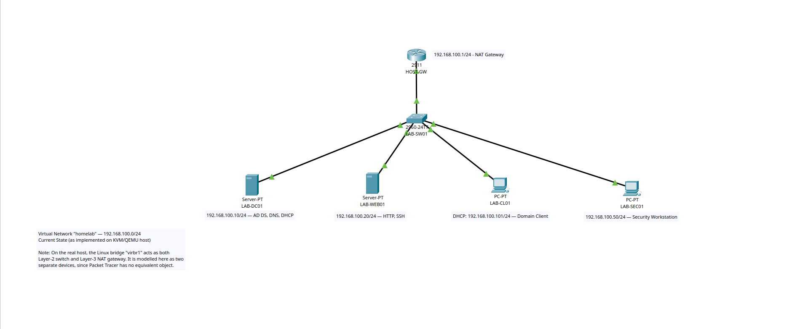
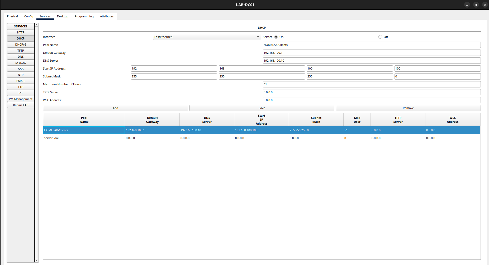
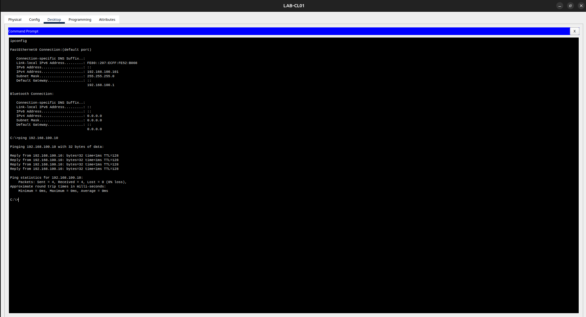
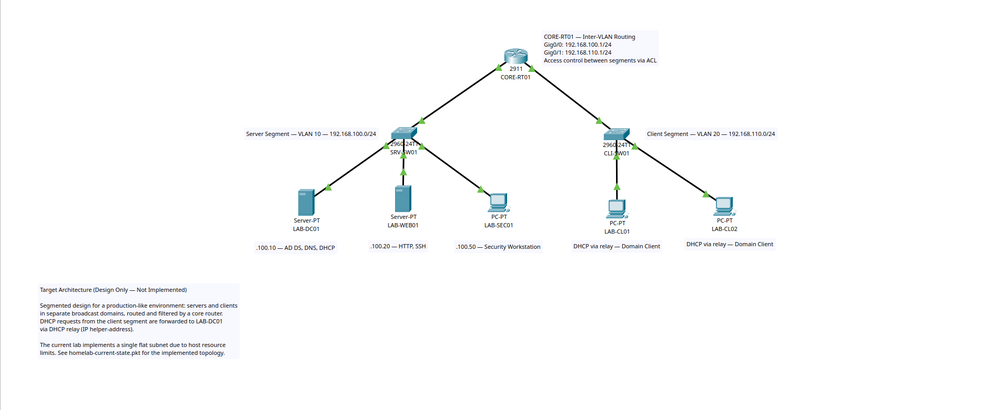

# Phase 1 — Netzwerkplanung

[🇬🇧 English](README.md) | **🇩🇪 Deutsch**

[← Zurück zur Projektübersicht](../../README.de.md)


---

## 1. Zweck

Vor der Installation des ersten Dienstes musste das Netzwerk geplant und überprüft werden.
Ziel dieser Phase war es, drei Fragen **auf dem Papier und im Simulator** zu beantworten —
nicht durch Ausprobieren an laufenden Systemen:

1. Funktioniert das Adressierungskonzept aus [`docs/ip-plan/`](../../docs/ip-plan/) tatsächlich?
2. Erhält ein Client von einem zentralen DHCP-Server eine korrekte Adresse inklusive
   Gateway und DNS?
3. Wie würde dieses Netzwerk in einer Produktivumgebung aussehen — und worin unterscheidet
   es sich von dem, was die verfügbare Hardware zulässt?

Dafür wurden zwei Topologien in Cisco Packet Tracer aufgebaut:

| Datei | Zweck |
| --- | --- |
| [`homelab-current-state.pkt`](../../packet-tracer/homelab-current-state.pkt) | Das Netzwerk, wie es auf dem KVM-Host umgesetzt wurde |
| [`homelab-target-architecture.pkt`](../../packet-tracer/homelab-target-architecture.pkt) | Der segmentierte Entwurf für eine Produktivumgebung |

---

## 2. Ist-Zustand — wie umgesetzt


*Abbildung 1.1 — Umgesetzte Topologie: ein flaches Subnetz `192.168.100.0/24`.*

### 2.1 Hinweis zur Modellierung

Auf dem realen Host erfüllt die Linux-Bridge `virbr1` **zwei Rollen gleichzeitig**: Sie
vermittelt den Verkehr zwischen den virtuellen Maschinen auf Layer 2 und trägt zugleich die
IP-Adresse `192.168.100.1` als NAT-Gateway auf Layer 3.

Packet Tracer kennt kein Objekt mit diesem Verhalten. Die Bridge wird daher als zwei
getrennte Geräte modelliert — ein Switch (`LAB-SW01`) und ein Router (`HOST-GW`). Dies ist
eine bewusste Vereinfachung der Simulation, kein Unterschied in der realen Konfiguration.

### 2.2 Portbelegung

| Gerät | Lokale Schnittstelle | Verbunden mit | Gegenstelle |
| --- | --- | --- | --- |
| `HOST-GW` | `GigabitEthernet0/0` | `LAB-SW01` | `GigabitEthernet0/1` |
| `LAB-DC01` | `FastEthernet0` | `LAB-SW01` | `FastEthernet0/1` |
| `LAB-WEB01` | `FastEthernet0` | `LAB-SW01` | `FastEthernet0/2` |
| `LAB-CL01` | `FastEthernet0` | `LAB-SW01` | `FastEthernet0/3` |
| `LAB-SEC01` | `FastEthernet0` | `LAB-SW01` | `FastEthernet0/4` |

### 2.3 Adressierung

| Gerät | IP-Adresse | Subnetzmaske | Gateway | DNS | Zuweisung |
| --- | --- | --- | --- | --- | --- |
| `HOST-GW` | 192.168.100.1 | 255.255.255.0 | — | — | statisch |
| `LAB-DC01` | 192.168.100.10 | 255.255.255.0 | 192.168.100.1 | 192.168.100.10 | statisch |
| `LAB-WEB01` | 192.168.100.20 | 255.255.255.0 | 192.168.100.1 | 192.168.100.10 | statisch |
| `LAB-SEC01` | 192.168.100.50 | 255.255.255.0 | 192.168.100.1 | 192.168.100.10 | statisch |
| `LAB-CL01` | 192.168.100.101 | 255.255.255.0 | 192.168.100.1 | 192.168.100.10 | DHCP |

Alle Clients verwenden `192.168.100.10` als **einzigen** DNS-Server. Es ist bewusst kein
öffentlicher Resolver eingetragen: Ein Domänenmitglied, das Namen über einen externen
DNS-Server auflöst, findet die `_ldap._tcp`-SRV-Einträge der Domäne nicht — der
Domänenbeitritt in Phase 4 würde dadurch fehlschlagen.

---

## 3. Konfiguration

### 3.1 Gateway-Router

```
hostname HOST-GW
no ip domain-lookup
!
interface GigabitEthernet0/0
 description LAN - homelab virtual network (192.168.100.0/24)
 ip address 192.168.100.1 255.255.255.0
 no shutdown
```

Die Router-Schnittstelle wurde erst nach `no shutdown` aktiv. Router-Schnittstellen von
Cisco sind standardmäßig `administratively down` — im Gegensatz zu Switch-Ports, die von
Anfang an aktiviert sind.

### 3.2 DHCP-Dienst auf `LAB-DC01`


*Abbildung 1.2 — DHCP-Bereich `HOMELAB-Clients` auf dem simulierten Domänencontroller.*

| Einstellung | Wert |
| --- | --- |
| Bereichsname | `HOMELAB-Clients` |
| Start-IP-Adresse | 192.168.100.100 |
| Subnetzmaske | 255.255.255.0 |
| Maximale Anzahl Clients | 51 (Bereich `.100` – `.150`) |
| Standardgateway (Option 003) | 192.168.100.1 |
| DNS-Server (Option 006) | 192.168.100.10 |

Der Bereich entspricht bewusst exakt dem DHCP-Bereich aus
[`docs/ip-plan/`](../../docs/ip-plan/). Zwei Parameter des realen Entwurfs lassen sich in
Packet Tracer nicht abbilden: die **Leasedauer** (8 Tage) und **Option 015 Domain Name**
(`corp.homelab.internal`). Beide werden in Phase 3 auf dem realen Windows Server
konfiguriert.

### 3.3 Beseitigung des DHCP-Konflikts auf dem Host

Das libvirt-Netzwerk `homelab` betrieb ursprünglich einen eigenen dnsmasq-DHCP-Server im
selben Subnetz. Zwei DHCP-Server in einer Broadcast-Domäne antworten im Wettlauf auf
Client-Anfragen. Die Folge sind unvorhersehbare Adressen und DNS-Einstellungen — und ein
fehlgeschlagener Domänenbeitritt.

Der integrierte DHCP-Dienst wurde daher entfernt, NAT und Gateway-Adresse blieben erhalten.
Die Konfiguration vor und nach der Änderung ist in [`configs/`](../../configs/)
dokumentiert, die Entscheidung in [ADR-002](../../docs/architecture/decisions.md).

---

## 4. Überprüfung


*Abbildung 1.3 — `LAB-CL01` erhält eine gültige Adresse und erreicht Gateway und Server.*

| # | Test | Befehl | Erwartetes Ergebnis | Ergebnis |
| --- | --- | --- | --- | --- |
| 1 | Client erhält Adresse | `ipconfig /all` auf `LAB-CL01` | Adresse aus `.100`–`.150`, GW `.1`, DNS `.10` | ✅ 192.168.100.101 |
| 2 | Client → Gateway | `ping 192.168.100.1` | 4/4 Antworten | ✅ 4/4 |
| 3 | Client → Domänencontroller | `ping 192.168.100.10` | 4/4 Antworten | ✅ 4/4 |
| 4 | Client → Webserver | `ping 192.168.100.20` | 4/4 Antworten | ✅ 4/4 |
| 5 | Webserver → Gateway | `ping 192.168.100.1` | 4/4 Antworten | ✅ 4/4 |
| 6 | Webserver → Domänencontroller | `ping 192.168.100.10` | 4/4 Antworten | ✅ 4/4 |
| 7 | Webserver → Sicherheitsarbeitsplatz | `ping 192.168.100.50` | 4/4 Antworten | ✅ 4/4 |

Alle sieben Tests wurden ohne Paketverlust bestanden.

---

## 5. Zielarchitektur — nur Entwurf


*Abbildung 1.4 — Zielarchitektur: Server und Clients in getrennten, gerouteten Segmenten.*

Das umgesetzte Labor verwendet ein flaches Subnetz, da 16 GB Hostspeicher und ein
Zeitbudget von einer Woche keine zusätzliche Routing-Infrastruktur rechtfertigen. In einer
Produktivumgebung wäre das nicht akzeptabel: Jeder Client läge in derselben
Broadcast-Domäne wie jeder Server, ohne eine Stelle, an der Verkehr gefiltert werden kann.

Der Zielentwurf trennt beides:

| Segment | VLAN | Subnetz | Gateway | Mitglieder |
| --- | --- | --- | --- | --- |
| Serversegment | 10 | 192.168.100.0/24 | 192.168.100.1 | `LAB-DC01`, `LAB-WEB01`, `LAB-SEC01` |
| Clientsegment | 20 | 192.168.110.0/24 | 192.168.110.1 | `LAB-CL01`, `LAB-CL02` |

```
interface GigabitEthernet0/0
 description Server segment - VLAN 10
 ip address 192.168.100.1 255.255.255.0
!
interface GigabitEthernet0/1
 description Client segment - VLAN 20
 ip address 192.168.110.1 255.255.255.0
```

### Konsequenzen der Segmentierung

1. **Inter-VLAN-Routing wird notwendig.** Clients erreichen die Server nur über
   `CORE-RT01` — und genau das ist der Zweck des Entwurfs: Es entsteht ein zentraler Punkt,
   an dem über Access Control Lists gesteuert werden kann, welcher Client welchen Dienst
   erreichen darf.
2. **DHCP benötigt ein Relay.** Eine DHCP-Discover-Nachricht ist ein Broadcast, und ein
   Router leitet Broadcasts nicht weiter. Ohne Hilfe würden Clients in VLAN 20 den
   DHCP-Server in VLAN 10 nie erreichen. Die Lösung ist `ip helper-address 192.168.100.10`
   auf der clientseitigen Schnittstelle, die die Anfrage als Unicast an den
   Domänencontroller weiterleitet.
3. **Der Adressplan berücksichtigt das bereits.** `192.168.110.0/24` wurde nicht für dieses
   Diagramm erfunden, sondern war von Beginn an als Clientsubnetz in `docs/ip-plan/`
   reserviert.

Festgehalten in [ADR-006](../../docs/architecture/decisions.md).

---

## 6. Ergebnis

- Das Adressierungskonzept wurde in der Simulation überprüft, bevor eine virtuelle Maschine
  angefasst wurde.
- Zentrales DHCP mit korrektem Gateway und DNS wurde vollständig nachgewiesen.
- Vollständige Erreichbarkeit auf Layer 2 und Layer 3 wurde durch sieben dokumentierte
  Tests bestätigt.
- Sowohl das umgesetzte Netzwerk als auch ein produktionsnaher Zielentwurf liegen als
  nachvollziehbare, versionierte Packet-Tracer-Dateien vor.

---

## 7. Lessons Learned

**Ein Router-Port ist kein Switch-Port.** Beide Verbindungen zum Router blieben inaktiv,
bis `no shutdown` eingegeben wurde. Switch-Ports sind standardmäßig aktiv, Router-Ports
nicht. Eine inaktive Verbindung im Diagramm ist selten ein Verkabelungsfehler, sondern
meist eine nicht konfigurierte Schnittstelle.

**Die erste Client-Adresse war `.101`, nicht `.100`.** Durch das Umschalten des Clients
zwischen statisch und DHCP wurde eine zweite Anfrage gesendet, während die erste Adresse
noch gebunden war — der Server vergab die nächste freie Adresse. Die Dokumentation hält die
tatsächlich zugewiesene Adresse fest, nicht die erwartete: Ein Dokument, das der Realität
widerspricht, ist schlechter als kein Dokument.

**Der Standardbereich `serverPool` in Packet Tracer lässt sich nicht löschen.** Er bleibt in
der Konfiguration, ist aber unkritisch: Er gehört zu einem anderen Subnetz, und ein
DHCP-Server antwortet nur aus einem Bereich, der zum Subnetz der eingehenden Anfrage passt.
Dieselbe Logik gilt für einen echten Windows-DHCP-Server.

**Ein Simulator hat Grenzen — sie zu benennen ist Teil der Arbeit.** Leasedauer und
DHCP-Option 015 ließen sich nicht abbilden, und die Linux-Bridge musste in zwei Geräte
aufgeteilt werden. Diese Lücken zu dokumentieren ist wertvoller als ein Diagramm, das
stillschweigend Vollständigkeit vorgibt.

---

## 8. Nächste Phase

[Phase 2 — Virtuelle Infrastruktur](../02-virtual-infrastructure/): Übertragung dieses
geprüften Entwurfs auf den KVM-Host, Überprüfung der virtuellen Maschinen und ihrer
Netzwerkanbindung.
