# Phase 3 — Active Directory Domain Services

🇬🇧 [English version](README.md)

---

## 1. Zweck

Phase 3 macht aus `LAB-DC01` einen zentralen Verzeichnisdienst. Ab diesem Punkt verwaltet die Domäne Identitäten, Namensauflösung und Adressvergabe.

Ergebnisse dieser Phase:

- Eine neue Active-Directory-Gesamtstruktur `corp.homelab.internal` mit dem Domänencontroller `LAB-DC01`
- DNS mit Forward-Zone, Reverse-Lookup-Zone und einer DNS-Weiterleitung ins Internet
- Ein in Active Directory autorisierter DHCP-Server mit aktivem Bereich für Clients
- Zuverlässige Zeitsynchronisation, von der Kerberos abhängt
- Eine Struktur aus Organisationseinheiten und ein Gruppenkonzept nach dem AGDLP-Modell von Microsoft
- Zwei Testbenutzer mit vollständigen Attributen

---

## 2. Entwurfsentscheidungen

| Entscheidung | Wert | Begründung |
| --- | --- | --- |
| Domänenname | `corp.homelab.internal` | `.local` ist laut RFC 6762 für mDNS reserviert und kollidiert mit der AD-Namensauflösung. Einteilige Namen wie `HOMELAB` führen zu DNS-Problemen. Eine Subdomäne eines nicht öffentlich nutzbaren Namens ist die sichere Wahl (ADR-003) |
| NetBIOS-Name | `HOMELAB` | Kurz und in Anmeldedialogen als `HOMELAB\Benutzername` lesbar. Der Assistent schlug `CORP` vor, was keine Information trägt |
| Funktionsebene der Gesamtstruktur und der Domäne | Windows Server 2016 | Die höchste von Windows Server 2019 unterstützte Ebene. Die Funktionsebene legt die Mindestversion eines Domänencontrollers fest |
| Serverrollen | DNS-Server, globaler Katalog | Erforderlich für den ersten Domänencontroller einer neuen Gesamtstruktur |
| RODC | deaktiviert | Ein schreibgeschützter Domänencontroller ist für unsichere Außenstandorte gedacht, nicht für eine Umgebung mit einem einzigen Controller |
| Statische IP-Adresse | 192.168.100.10 | Ein Domänencontroller darf seine Adresse nie per DHCP erhalten, weil er DHCP selbst bereitstellt |
| Eigener DNS-Server | 192.168.100.10 | Der Server verweist auf sich selbst, weil er autoritativer DNS-Server der Domäne wird |
| Zeitzone | UTC | Siehe Abschnitt 7 |

---

## 3. Vorbereitung des Servers

Vor der Rolleninstallation wurden Hostname und Netzwerkkonfiguration mit PowerShell gesetzt:

```powershell
Set-NetIPInterface -InterfaceAlias "Ethernet" -Dhcp Disabled
New-NetIPAddress -InterfaceAlias "Ethernet" -IPAddress 192.168.100.10 -PrefixLength 24 -DefaultGateway 192.168.100.1
Set-DnsClientServerAddress -InterfaceAlias "Ethernet" -ServerAddresses 192.168.100.10
Rename-Computer -NewName "LAB-DC01" -Force
Restart-Computer -Force
```

DHCP wird **vor** der Zuweisung der statischen Adresse deaktiviert. Eine statische Adresse bei noch aktivem DHCP kann die Schnittstelle in einen inkonsistenten Zustand bringen.

> Vor dieser Änderung trug die Schnittstelle die Adresse `169.254.237.170`. Das ist eine Adresse aus dem APIPA-Bereich, die Windows sich selbst zuweist, wenn kein DHCP-Server antwortet — das erwartete Ergebnis, nachdem der libvirt-DHCP-Server in Phase 2 entfernt wurde. **Eine Adresse aus 169.254.0.0/16 bedeutet immer dasselbe: der Client hat keinen DHCP-Server erreicht.**

Computername und Netzwerkkonfiguration müssen vor der Heraufstufung endgültig sein. Ein Domänencontroller kann später umbenannt werden, das betrifft aber DNS-Einträge, Kerberos-Dienstprinzipalnamen und die Replikation und wird deshalb vermieden.

---

## 4. Installation und Heraufstufung des Domänencontrollers

Die Rolle wurde bewusst über die grafische Oberfläche installiert: die Seiten des Assistenten dokumentieren die Konfigurationsentscheidungen besser als ein einzelner PowerShell-Befehl.

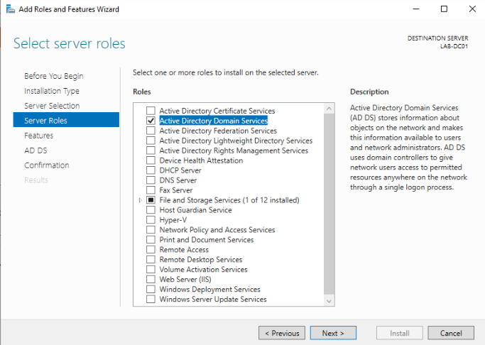
*Abbildung 3.1 — Hinzufügen der Rolle Active Directory Domain Services samt Verwaltungswerkzeugen.*

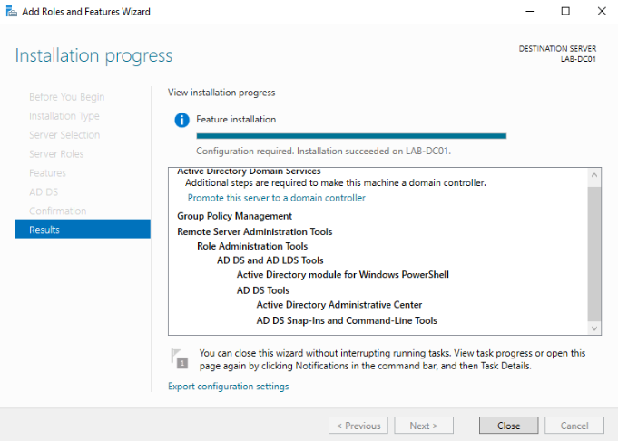
*Abbildung 3.2 — `Configuration required. Installation succeeded on LAB-DC01`. Die Rolle ist installiert, der Server ist noch kein Domänencontroller.*

**Rolleninstallation und Heraufstufung sind zwei getrennte Vorgänge:**

| Schritt | Was geschieht |
| --- | --- |
| Rolleninstallation | Dateien, Dienste und Verwaltungswerkzeuge werden auf die Festplatte kopiert. Der Server bleibt ein Einzelserver |
| Heraufstufung | Gesamtstruktur und Domäne werden erstellt, die NTDS-Datenbank wird aufgebaut, der Server wird Domänencontroller |

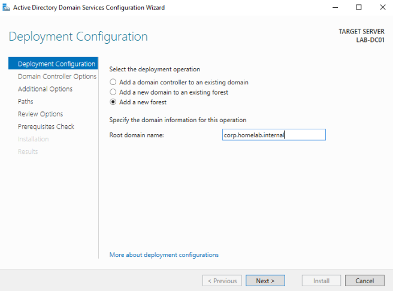
*Abbildung 3.3 — `Add a new forest` mit dem Stammdomänennamen `corp.homelab.internal`.*

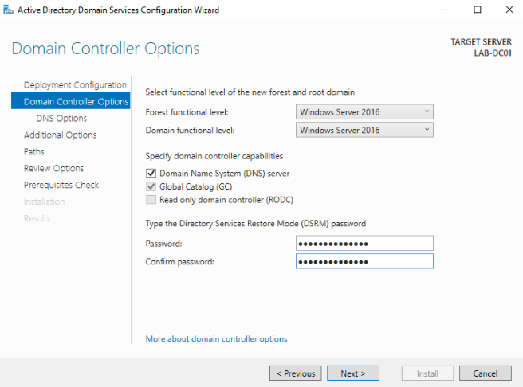
*Abbildung 3.4 — Funktionsebene Windows Server 2016, DNS-Server und globaler Katalog aktiviert, RODC deaktiviert, DSRM-Kennwort gesetzt.*

Das Kennwort für den **Verzeichnisdienst-Wiederherstellungsmodus** ist nicht das Administratorkennwort. Es gewährt Zugang zu einem speziellen Startmodus, in dem die AD-Datenbank offline reparierbar ist, während der Verzeichnisdienst selbst nicht läuft — genau die Situation, in der die normale Domänenanmeldung nicht verfügbar ist. Ein Domänencontroller mit unbekanntem DSRM-Kennwort ist nicht reparierbar.

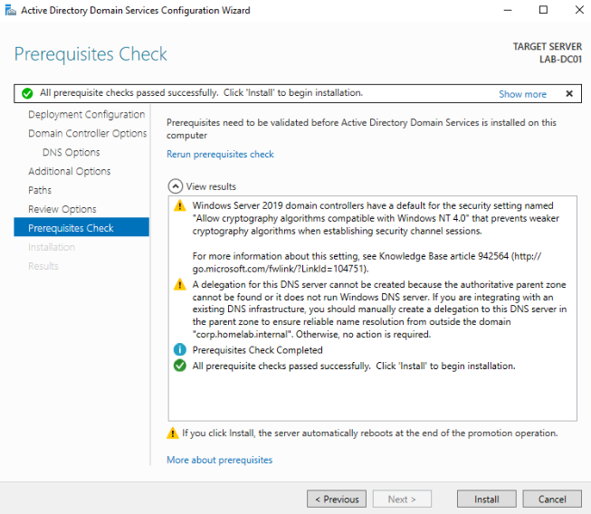
*Abbildung 3.5 — `All prerequisite checks passed successfully` mit zwei erwarteten Warnungen.*

### Die Warnung zur DNS-Delegierung

Der Assistent meldet:

> A delegation for this DNS server cannot be created because the authoritative parent zone cannot be found.

Die übergeordnete Zone von `corp.homelab.internal` wäre `homelab.internal`, die nicht existiert und auch nicht existieren soll. **Die Warnung ist korrekt und wurde bewusst ignoriert.** In einer Domäne, die mit öffentlichem DNS verbunden ist, wäre dieselbe Warnung ein echtes Problem, weil die externe Namensauflösung in die Domäne fehlschlagen würde.

---

## 5. DNS-Konfiguration

Die Heraufstufung erstellt die Forward-Zone `corp.homelab.internal` und die Spezialzone `_msdcs.corp.homelab.internal` automatisch. Zwei Dinge wurden ergänzt:

```powershell
Add-DnsServerPrimaryZone -NetworkID "192.168.100.0/24" -ReplicationScope "Domain"
Add-DnsServerForwarder -IPAddress 192.168.100.1
ipconfig /registerdns
```

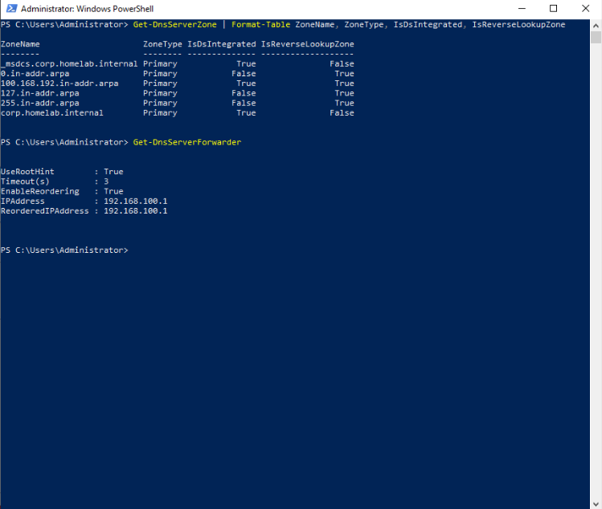
*Abbildung 3.6 — Forward-Zone, Reverse-Lookup-Zone `100.168.192.in-addr.arpa` und die Weiterleitung an das Gateway.*

**Die Reverse-Lookup-Zone** löst in umgekehrter Richtung auf, von der Adresse zum Namen. Der Zonenname kehrt die Oktette um, weil DNS seine Hierarchie von rechts nach links aufbaut. Ohne sie zeigen Verwaltungswerkzeuge und Protokolldateien nur IP-Adressen statt Servernamen, was die Fehlerbehebung erschwert.

**Die DNS-Weiterleitung** beantwortet jede Anfrage, die nicht zur Domäne gehört. Der DNS-Server kennt nur `corp.homelab.internal`; alles andere geht an `192.168.100.1`, das libvirt-NAT-Gateway. Deshalb benötigen Clients genau einen DNS-Server — den Domänencontroller — und lösen trotzdem Internetnamen auf.

> **Aktualisierung (Phase 5):** Die Weiterleitung wurde später auf die öffentlichen Resolver `8.8.8.8` und `1.1.1.1` umgestellt. Der Provider-Resolver hinter dem NAT-Gateway lieferte für einige externe Namen CNAME-Ketten ohne A-Eintrag zurück, wodurch die Paketinstallation auf dem Linux-Server unmöglich war. Siehe [ADR-011](../../docs/architecture/decisions.md) und [Phase 5](../05-linux-server/).

**`-ReplicationScope Domain`** speichert die Zone in der AD-Datenbank statt in einer Textdatei, sodass ein künftiger zweiter Domänencontroller sie über die Replikation erhält.

---

## 6. DHCP-Konfiguration

```powershell
Install-WindowsFeature -Name DHCP -IncludeManagementTools
Add-DhcpServerInDC -DnsName LAB-DC01.corp.homelab.internal -IPAddress 192.168.100.10

Add-DhcpServerv4Scope -Name "HOMELAB-Clients" -Description "Client range for lab workstations" `
  -StartRange 192.168.100.100 -EndRange 192.168.100.150 -SubnetMask 255.255.255.0 `
  -LeaseDuration 8.00:00:00 -State Active

Set-DhcpServerv4OptionValue -ScopeId 192.168.100.0 -Router 192.168.100.1 `
  -DnsServer 192.168.100.10 -DnsDomain "corp.homelab.internal"
```

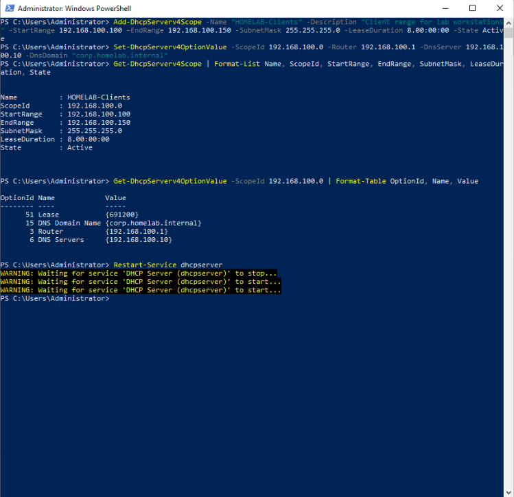
*Abbildung 3.7 — Aktiver Bereich `HOMELAB-Clients` mit den konfigurierten Optionen.*

| Option | Name | Wert | Zweck |
| --- | --- | --- | --- |
| 003 | Router | 192.168.100.1 | Standardgateway |
| 006 | DNS-Server | 192.168.100.10 | Der Domänencontroller, und nur er |
| 015 | DNS-Domänenname | corp.homelab.internal | DNS-Suffix, damit kurze Namen auflösen |
| 051 | Leasedauer | 691200 Sekunden | 8 Tage, automatisch aus `-LeaseDuration` |

Die Optionsnummern sind in RFC 2132 definiert und auf jeder DHCP-Implementierung identisch, ob Windows, Cisco oder `isc-dhcp` unter Linux.

**Option 006 ist entscheidend.** Ein zweiter DNS-Server wie `8.8.8.8` in dieser Liste würde dazu führen, dass Clients SRV-Anfragen an einen Server senden, der sie nicht beantworten kann. Die Domänenaufnahme scheitert dann mit einer Fehlermeldung, die DNS nicht erwähnt.

### Autorisierung in Active Directory

`Add-DhcpServerInDC` autorisiert den Server. Windows-DHCP-Server fragen Active Directory, bevor sie einem Client antworten; ein nicht autorisierter Server startet seinen Dienst, vergibt aber keine Adressen.

Das schützt vor einem **nicht autorisierten DHCP-Server** — einem Heimrouter oder Laptop im Firmennetz, der falsche Adressen und Gateways verteilt. **Die Grenze dieses Schutzes muss man kennen:** nur in die Domäne aufgenommene Windows-Server stellen diese Frage. Ein Router oder ein Linux-Host tut das nicht und vergibt Adressen unabhängig davon. Der Mechanismus schützt das Netz vor Administratorfehlern, nicht vor einem Angreifer.

> Genau deshalb musste der libvirt-`dnsmasq`-DHCP-Server in Phase 2 manuell entfernt werden (ADR-002). Er läuft unter Linux und hätte nie nach einer Autorisierung gefragt.

---

## 7. Zeitsynchronisation

```powershell
w32tm /config /manualpeerlist:"pool.ntp.org,0x8" /syncfromflags:manual /reliable:yes /update
Restart-Service w32time
w32tm /resync
```

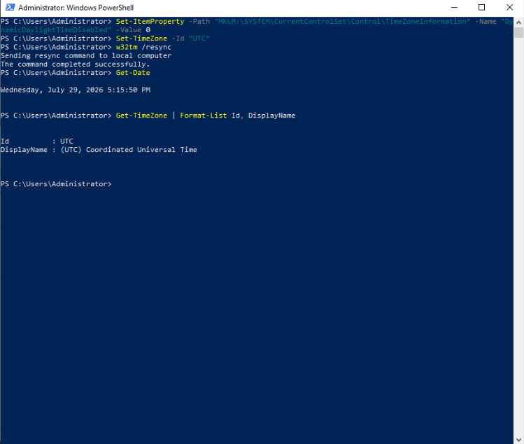
*Abbildung 3.8 — Zeitzone nach der Synchronisation auf UTC gesetzt.*

Kerberos schreibt in jedes Ticket einen Zeitstempel. Weichen die Uhren von Client und Domänencontroller um mehr als **fünf Minuten** ab, wird das Ticket abgelehnt und die Anmeldung schlägt fehl — mit einer Meldung, die nichts von Zeit erwähnt. Die Toleranz existiert zur Abwehr von Replay-Angriffen.

### Zeithierarchie in einer Domäne

```
Externe NTP-Quelle
    └── Domänencontroller mit der PDC-Emulator-Rolle   ← LAB-DC01
            └── Weitere Domänencontroller
                    └── Mitgliedsserver und Clients
```

Clients holen ihre Zeit nie aus dem Internet, sondern vom Domänencontroller. Nur der Inhaber der PDC-Emulator-Rolle synchronisiert extern, was `/reliable:yes` erklärt. Die `nltest`-Ausgabe bestätigt die Flags `PDC`, `TIMESERV` und `GTIMESERV`.

### Zeitzone: eine beobachtete Auffälligkeit

Nach erfolgreicher Synchronisation lief die Serveruhr eine Stunde vor. Die Ursache war nicht NTP: **Iran hat die Sommerzeit 2022 abgeschafft, dieser nicht aktualisierte Windows Server 2019 enthielt die veraltete Regel noch.** Die interne UTC-Uhr war korrekt, nur die Umrechnung in die Ortszeit war falsch.

Das Deaktivieren der dynamischen Sommerzeitregelung über die Registrierung half nicht. Statt weiter an der Regel zu arbeiten, wurde der Server auf **UTC** gestellt — eine Zeitzone ohne Sommerzeit und damit ohne Regel, die veralten kann.

Das entspricht der üblichen Praxis in Produktionsumgebungen: **Server laufen in UTC, Arbeitsstationen in lokaler Zeit.** Kerberos vergleicht Zeitstempel in UTC, eine abweichende Anzeigezeit auf dem Client ist deshalb unkritisch. Die richtige langfristige Lösung ist die Installation der Windows-Updates, die aktuelle Zeitzonendaten mitbringen — das Gegenstück zum Paket `tzdata` unter Linux.

---

## 8. Struktur der Organisationseinheiten

```
corp.homelab.internal
└── OU=HOMELAB
    ├── OU=Users
    │   ├── OU=IT
    │   ├── OU=Sales
    │   └── OU=Management
    ├── OU=Groups
    ├── OU=Computers
    │   ├── OU=Workstations
    │   └── OU=Servers
    └── OU=ServiceAccounts
```

Alle Organisationseinheiten wurden mit `-ProtectedFromAccidentalDeletion $true` erstellt.

**Warum eine übergeordnete Organisationseinheit statt der Domänenwurzel?** Eine Gruppenrichtlinie auf der Domänenwurzel gilt auch für die Domänencontroller selbst. Eine übergeordnete Einheit bietet einen saubereren Anwendungspunkt.

**Warum Benutzer und Computer trennen?** Gruppenrichtlinien haben zwei unabhängige Hälften, `Computerkonfiguration` und `Benutzerkonfiguration`. Die Trennung erlaubt Kennwortrichtlinien für Computer und Desktoprichtlinien für Benutzer ohne gegenseitige Störung.

**Warum eine eigene Einheit für Dienstkonten?** Dienstkonten brauchen andere Regeln: Kennwörter, die nicht ablaufen, und keine interaktive Anmeldung. Sie von Anfang an zu trennen ist eine Sicherheitsentscheidung, keine Kosmetik.

**Warum der Schutz vor versehentlichem Löschen?** Das Löschen einer Organisationseinheit löscht ihren gesamten Inhalt. In einem Unternehmen mit mehreren hundert Benutzern zerstört ein Fehlklick einen Arbeitstag.

---

## 9. Gruppenkonzept: AGDLP

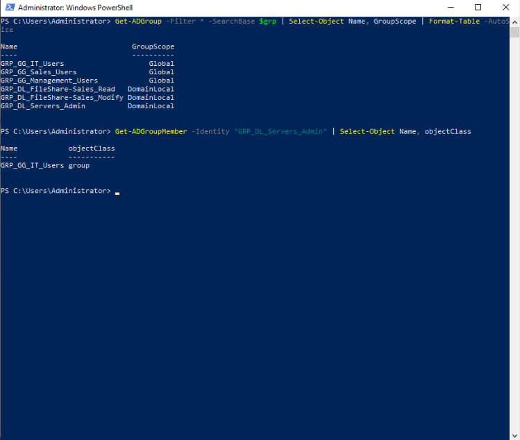
*Abbildung 3.9 — Globale Rollengruppen, domänenlokale Ressourcengruppen und die Verschachtelung dazwischen.*

| Gruppe | Bereich | Bedeutung |
| --- | --- | --- |
| `GRP_GG_IT_Users` | Global | Rolle: Mitarbeitende der IT-Abteilung |
| `GRP_GG_Sales_Users` | Global | Rolle: Mitarbeitende im Vertrieb |
| `GRP_GG_Management_Users` | Global | Rolle: Geschäftsleitung |
| `GRP_DL_FileShare-Sales_Read` | Domänenlokal | Zugriff: Lesen auf der Vertriebsfreigabe |
| `GRP_DL_FileShare-Sales_Modify` | Domänenlokal | Zugriff: Ändern auf der Vertriebsfreigabe |
| `GRP_DL_Servers_Admin` | Domänenlokal | Zugriff: lokaler Administrator auf Mitgliedsservern |

Das Modell von Microsoft lautet **A**ccount → **G**lobal group → **D**omain **L**ocal group → **P**ermission:

1. Das Benutzerkonto kommt in eine **globale Gruppe**, die eine organisatorische Rolle abbildet
2. Die globale Gruppe wird Mitglied einer **domänenlokalen Gruppe**, die genau ein Zugriffsrecht abbildet
3. Die **Berechtigung** wird nur der domänenlokalen Gruppe erteilt — nie einem Benutzer, nie einer globalen Gruppe

**Warum sich dieser Umweg auszahlt:** wechselt eine Mitarbeiterin vom Vertrieb ins Marketing, ist genau eine Änderung nötig — die Gruppenmitgliedschaft. Alle alten Zugriffe enden und alle neuen beginnen automatisch. Ohne das Modell müsste jede Freigabe einzeln geprüft werden, was in der Praxis nicht geschieht. Das Ergebnis ist **Rechteausweitung**: Benutzer behalten Zugriffe, die sie nicht mehr haben dürfen — eine der häufigsten Feststellungen in Sicherheitsprüfungen.

| Typ | Mögliche Mitglieder | Wo Berechtigungen erteilt werden können |
| --- | --- | --- |
| Global | Konten und globale Gruppen **derselben Domäne** | In **jeder Domäne** der Gesamtstruktur |
| Domänenlokal | Konten und Gruppen **jeder Domäne** | Nur in **derselben Domäne** |

Globale Gruppen beantworten „wer bist du“, domänenlokale Gruppen „worauf darfst du zugreifen“. In einer Gesamtstruktur mit einer einzigen Domäne ist der Unterschied praktisch nicht sichtbar — das Modell wurde dennoch von Anfang an korrekt umgesetzt, weil es in einer Umgebung mit mehreren Domänen unverzichtbar ist.

Namenskonvention: `GRP_<Bereich>_<Ressource>_<Berechtigung>`.

---

## 10. Benutzerkonten

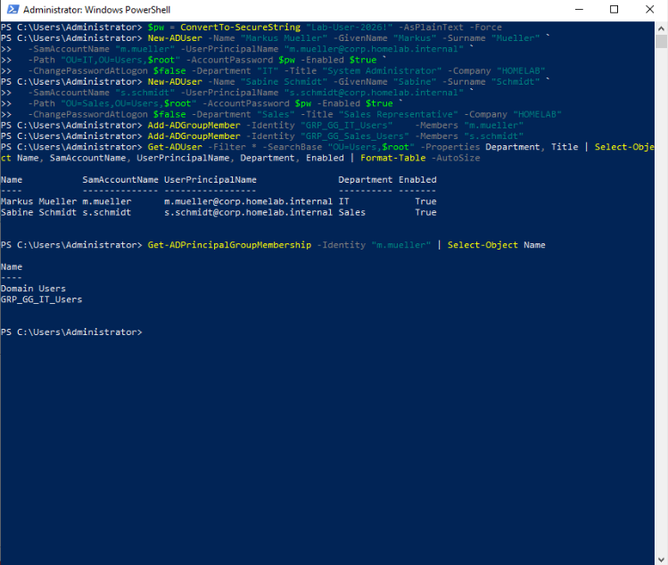
*Abbildung 3.10 — Zwei Benutzer mit Abteilung und Position sowie die Gruppenmitgliedschaft von `m.mueller`.*

| Anzeigename | Anmeldename | UPN | Organisationseinheit | Abteilung | Gruppe |
| --- | --- | --- | --- | --- | --- |
| Markus Mueller | `m.mueller` | `m.mueller@corp.homelab.internal` | `OU=IT,OU=Users,OU=HOMELAB` | IT | `GRP_GG_IT_Users` |
| Sabine Schmidt | `s.schmidt` | `s.schmidt@corp.homelab.internal` | `OU=Sales,OU=Users,OU=HOMELAB` | Sales | `GRP_GG_Sales_Users` |

**`SamAccountName` und `UserPrincipalName` sind beide erforderlich.** Der erste ist der klassische Anmeldename (`HOMELAB\m.mueller`, maximal 20 Zeichen), der zweite die moderne Form in Mail-Schreibweise. Manche Anwendungen akzeptieren nur eine der beiden, ein Konto ohne UPN kann sich an bestimmten Diensten nicht anmelden. Das Muster `Vorname-Initial.Nachname` ist die verbreitetste Konvention in deutschen Unternehmen.

**`Department` und `Title` wurden bewusst gefüllt.** Diese Attribute sind keine Zierde: Gruppenrichtlinienfilterung, dynamische Gruppenmitgliedschaften und Verzeichnissynchronisation greifen darauf zu. Ein Konto mit leeren Attributen ist ein unvollständiges Konto.

**Dokumentierte Vereinfachung:** die Konten wurden mit `-ChangePasswordAtLogon $false` erstellt. In einer Produktionsumgebung muss dieser Wert `$true` sein, weil ein Administrator das Kennwort eines Benutzers nicht kennen sollte. Der Laborwert wurde gewählt, damit wiederholte Tests der Domänenaufnahme nicht jedes Mal eine Kennwortänderung erfordern.

---

## 11. Überprüfung

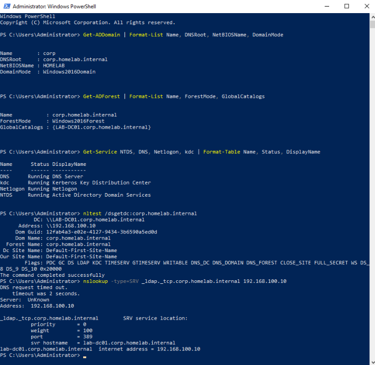
*Abbildung 3.11 — Domäne, Gesamtstruktur, Dienste, Domänencontrollersuche und SRV-Eintrag.*

| Test | Befehl | Ergebnis | Status |
| --- | --- | --- | --- |
| Domäne erstellt | `Get-ADDomain` | `corp.homelab.internal`, NetBIOS `HOMELAB`, `Windows2016Domain` | ✅ |
| Gesamtstruktur erstellt | `Get-ADForest` | `Windows2016Forest`, globaler Katalog `LAB-DC01` | ✅ |
| Kritische Dienste laufen | `Get-Service NTDS, DNS, Netlogon, kdc` | alle vier `Running` | ✅ |
| Domänencontroller auffindbar | `nltest /dsgetdc:corp.homelab.internal` | `LAB-DC01`, Flags `PDC GC KDC TIMESERV WRITABLE` | ✅ |
| SRV-Einträge vorhanden | `nslookup -type=SRV _ldap._tcp.corp.homelab.internal` | Port 389, `lab-dc01.corp.homelab.internal` | ✅ |
| Reverse-Auflösung | `nslookup 192.168.100.10` | `LAB-DC01.corp.homelab.internal` | ✅ |
| Internetauflösung über die Weiterleitung | `Resolve-DnsName www.google.com` | A- und AAAA-Einträge geliefert | ✅ |
| DHCP autorisiert | `Get-DhcpServerInDC` | `192.168.100.10`, `lab-dc01.corp.homelab.internal` | ✅ |
| DHCP-Bereich aktiv | `Get-DhcpServerv4Scope` | `HOMELAB-Clients`, `State: Active` | ✅ |
| Externe Zeitquelle | `w32tm /query /status` | `Stratum: 3`, Quelle `pool.ntp.org` | ✅ |
| Organisationseinheiten erstellt | `Get-ADOrganizationalUnit -Filter *` | zehn Einheiten in der geplanten Hierarchie | ✅ |
| Gruppenverschachtelung korrekt | `Get-ADGroupMember GRP_DL_Servers_Admin` | `GRP_GG_IT_Users`, `objectClass: group` | ✅ |

Der wichtigste dieser Tests ist die Abfrage der SRV-Einträge. Ein Windows-Client kennt die Adresse eines Domänencontrollers nie im Voraus; er fragt DNS, welcher Host den LDAP-Dienst der Domäne anbietet. **Fehlen diese Einträge, existiert die Domäne aus Sicht der Clients nicht — unabhängig davon, wie gesund der Server ist.**

---

## 12. Sicherungspunkte

| Name | Zustand |
| --- | --- |
| `phase02-baseline-clean` | Saubere Ausgangsbasis aus Phase 2 |
| `phase03-pre-adds` | Statische IP-Adresse und Hostname gesetzt, vor der ADDS-Installation |
| `phase03-post-adds-working` | Geprüfter, funktionierender Domänencontroller mit DNS, DHCP, Zeitsynchronisation, Organisationseinheiten, Gruppen und Benutzern |

Der zweite Wiederherstellungspunkt hat einen konkreten Grund. Eine Rückkehr zu `phase03-pre-adds` nach einer fehlgeschlagenen Domänenaufnahme würde den Neuaufbau der gesamten Domäne bedeuten — zwanzig Minuten Installation plus alle Organisationseinheiten, Gruppen und Benutzer. Die Rückkehr zu `phase03-post-adds-working` dauert Sekunden.

---

## 13. Ergebnis

`corp.homelab.internal` ist in Betrieb und geprüft. Der Domänencontroller stellt Verzeichnisdienst, Namensauflösung, Adressvergabe und Zeit als Referenz bereit. Die Struktur aus Organisationseinheiten und Gruppen folgt einem dokumentierten Modell statt zufällig zu wachsen, und das Labor ist bereit für die Domänenaufnahme in Phase 4.

---

## 14. Gelernte Lektionen

**Fehler und Nebenwirkung unterscheiden.** `nslookup -type=SRV` gab den SRV-Eintrag korrekt zurück, zeigte davor aber `Server: UnKnown` und `DNS request timed out`. Der Fehlschlag betraf die Reverse-Auflösung des DNS-Servernamens, nicht die eigentliche Abfrage. Genau zu lesen, welcher Teil einer Ausgabe fehlschlägt, erspart Stunden Suche nach einem Problem, das es nicht gibt.

**Eine verstandene Warnung darf ignoriert werden, eine unverstandene nicht.** Die Warnung zur DNS-Delegierung ist für eine interne Domäne korrekt und wäre in einer mit dem Internet verbundenen Domäne ein ernstes Problem. Der Unterschied zwischen „ich habe die Warnung nicht gesehen“ und „ich habe die Warnung verstanden“ ist der ganze Abstand zwischen beiden.

**NTP korrigiert die Uhr, nicht die Zeitzone.** Windows hält die Zeit intern in UTC; die Zeitzone ist eine Anzeigeschicht. Eine korrekte UTC-Uhr mit einer veralteten Sommerzeitregel zeigt trotzdem die falsche Zeit. Zeitzonenregeln sind Daten, keine Programmlogik — ein Server, der nie aktualisiert wird, zeigt irgendwann selbst bei perfekter Synchronisation die falsche Zeit.

**Die erste Lösung ist nicht immer die richtige.** Das Deaktivieren der dynamischen Sommerzeitregelung über die Registrierung entfernte die veraltete Regel nicht. Der Wechsel auf UTC löste das Problem und entsprach zugleich der Branchenpraxis. Zu erkennen, dass eine Umgehungslösung nicht funktioniert, ist wertvoller, als sie zu verteidigen.

**Ein Simulator ist kein Server.** In Cisco Packet Tracer ist die Leasedauer nicht konfigurierbar und Option 015 existiert nicht. Der Vergleich des Modells aus Phase 1 mit der realen Umsetzung zeigt genau, wo die Grenzen des Werkzeugs liegen — diese Grenzen zu kennen gehört zum kompetenten Einsatz.

**Die Struktur ist der eigentlich schwierige Teil.** Active Directory zu installieren ist ein Assistent. Zu entscheiden, warum die Organisationseinheiten so angeordnet sind, warum die Gruppen AGDLP folgen und warum der Domänenname nicht `.local` lautet, ist die Arbeit, die kein Assistent übernimmt.

---

## 15. Nächste Phase

**Phase 4 — Domänenaufnahme und Clientverwaltung:** Sicherungspunkt `phase04-pre-domain-join`, Aufnahme von `LAB-CL01` in `corp.homelab.internal`, Überprüfung der DHCP-Lease und des DNS-Suffix sowie Anmeldetests mit `m.mueller` einschließlich `nltest /dsgetdc:`.

[⬅ Phase 2 — Virtuelle Infrastruktur](../02-virtual-infrastructure/README.de.md) · [Zurück zur Projektübersicht](../../README.de.md)
