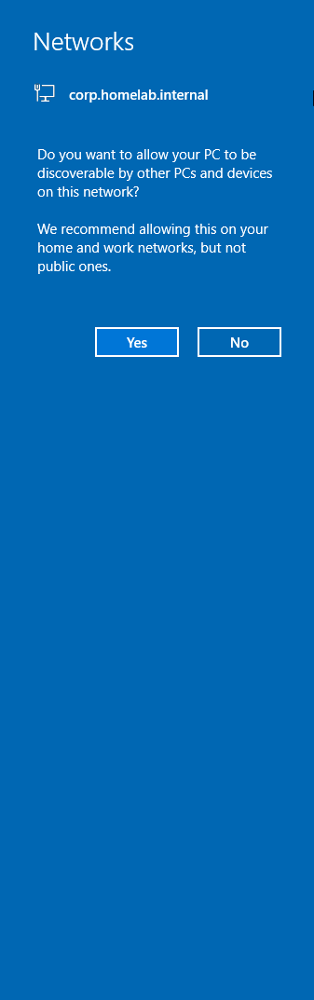
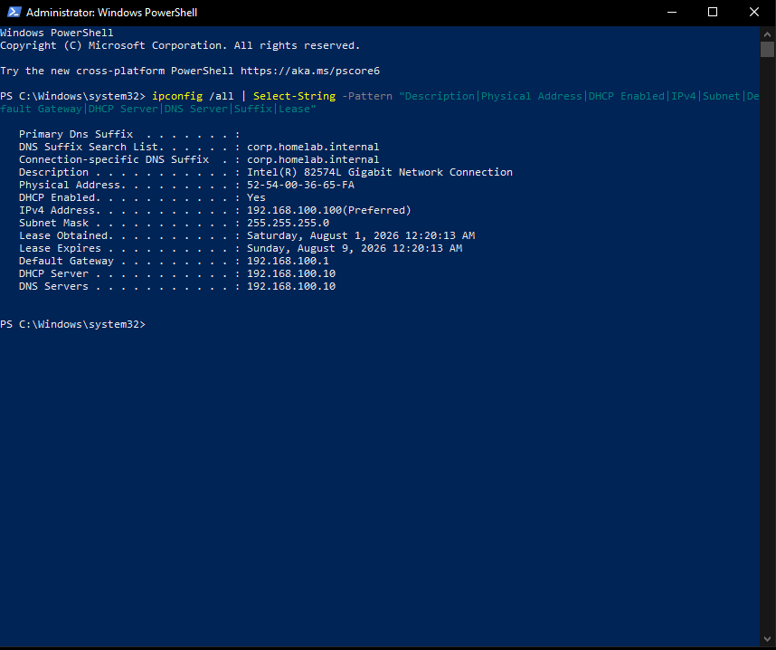
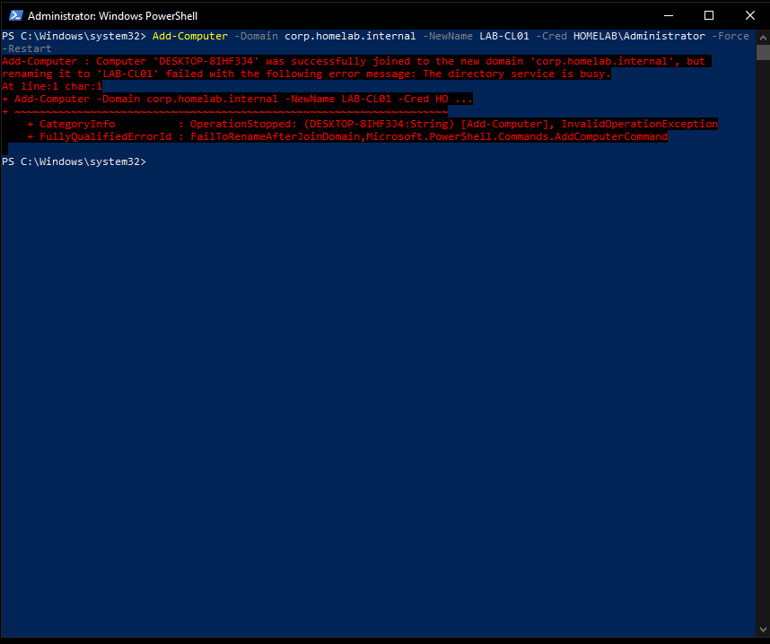
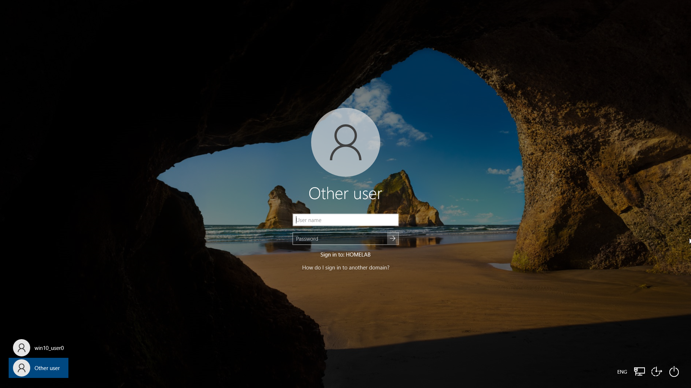
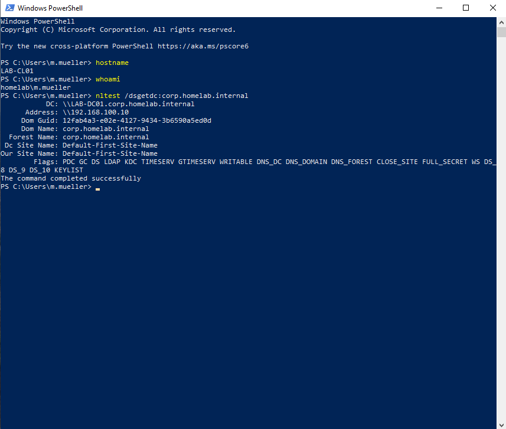
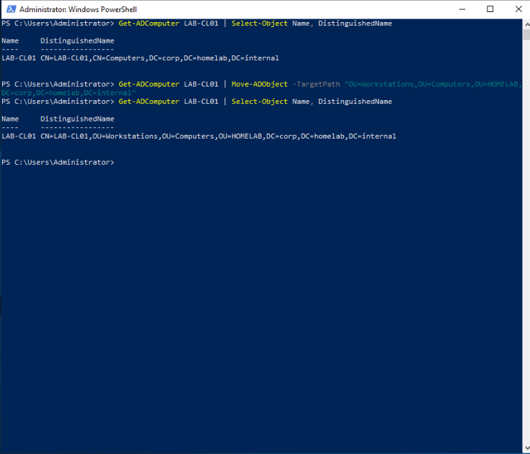

# Phase 4 — Windows-Client: Domänenbeitritt und Authentifizierung

🇬🇧 [This page in English](README.md)

> Teil des [Homelab-Projekts](../../README.de.md) · Vorherige Phase: [Phase 3 — Active Directory](../03-active-directory/README.de.md)

---

## 1. Zielsetzung

In Phase 3 wurde die Domäne aufgebaut. Phase 4 beantwortet die einzige Frage, die deren Funktion belegt:

> **Kann ein Client seine Netzwerkkonfiguration automatisch beziehen, den Domänencontroller selbstständig finden, der Domäne beitreten und einen normalen Benutzer authentifizieren?**

Ein Domänencontroller, dem nie ein Client beitritt, ist eine ungeprüfte Annahme. Diese Phase macht aus der Annahme einen Nachweis.

Ein zweites Ziel ist bewusst in diese Phase eingebaut: Sie ist die **abschließende Überprüfung von Phase 2**. Dort wurde der libvirt-interne DHCP-Server entfernt, damit der Windows-DHCP-Server der einzige Adressgeber im Segment ist. Diese Änderung war damals nicht nachweisbar, weil es noch keinen DHCP-Client gab. Der Nachweis erfolgt hier.

| Punkt | Wert |
| --- | --- |
| Client-VM | `LAB-CL01` |
| Betriebssystem | Windows 10 Pro 22H2 |
| Adressvergabe | DHCP (`192.168.100.100–150`) |
| Domäne | `corp.homelab.internal` |
| Testbenutzer | `HOMELAB\m.mueller` |
| Dauer | ca. 60 Minuten |

---

## 2. Ausgangslage

Vor dem ersten Befehl befand sich die Umgebung in folgendem Zustand:

- `LAB-DC01` — heruntergefahren, mit Sicherungspunkt `phase03-post-adds-working`
- `LAB-CL01` — heruntergefahren, Windows 10 installiert, Mitglied einer **Arbeitsgruppe**, Computername `DESKTOP-8IHF3J4`
- libvirt-Netzwerk `homelab` — aktiv, NAT, Gateway `192.168.100.1`, **ohne DHCP-Block**
- Noch nie hatte ein Client eine Adresse aus dem Windows-DHCP-Bereich angefordert

Die Startreihenfolge ist wesentlich und wurde bewusst gewählt: **zuerst der Domänencontroller, dann der Client**. Ein Client, der in ein Segment ohne DHCP-Server startet, fällt auf eine Adresse aus dem APIPA-Bereich (`169.254.x.x`) zurück und müsste seine Adresse anschließend manuell erneuern — womit genau der Nachweis verloren geht, um den es in dieser Phase geht.

---

## 3. Sicherungspunkte als Strategie

Ein Domänenbeitritt ist keine umkehrbare Einstellung. Er erzeugt ein Computerkonto im Active Directory, verändert die Sicherheitsbeziehung der Maschine und passt lokale Sicherheitsrichtlinien an. Ein späterer Austritt stellt den vorherigen Zustand **nicht** wieder her.

Deshalb wurde **vor** jeder Änderung ein Wiederherstellungspunkt erstellt:

```bash
virsh snapshot-create-as --domain LAB-CL01 \
  --name phase04-pre-domain-join \
  --description "Windows 10 22H2, workgroup state, before joining corp.homelab.internal" \
  --atomic
```

Die VM war zu diesem Zeitpunkt ausgeschaltet. Ein Sicherungspunkt einer heruntergefahrenen Maschine ist der sauberste mögliche Wiederherstellungspunkt, da kein flüchtiger Speicherzustand mitgesichert werden muss.

---

## 4. Überprüfung der DHCP-Adressvergabe

### 4.1 Serverzustand vor dem Start des Clients

Auf `LAB-DC01` wurden zunächst die relevanten Dienste und der Bereich geprüft; die Liste der Adressvergaben war nachweislich **leer**:

```powershell
Get-Service NTDS, DNS, Netlogon, kdc, DHCPServer | Format-Table Name, Status -AutoSize
Get-DhcpServerv4Scope | Format-Table Name, ScopeId, StartRange, EndRange, State -AutoSize
Get-DhcpServerv4Lease -ScopeId 192.168.100.0
```

Alle fünf Dienste meldeten `Running`, der Bereich `HOMELAB-Clients` meldete `Active`, und es existierte keine einzige Vergabe. Die leere Liste ist keine Nebensächlichkeit: Jede Adresse, die der Client danach erhält, lässt sich damit eindeutig diesem Server zuordnen.

### 4.2 Erster Kontakt

Unmittelbar nach der ersten Anmeldung zeigte Windows die Abfrage zum Netzwerkstandort. Diese enthielt bereits den Domänennamen:


*Abbildung 4.1 — Windows benennt das Netzwerk nach dem per DHCP-Option 015 empfangenen DNS-Suffix, noch vor jeder manuellen Konfiguration.*

Dies war der erste Nachweis, dass der Client vom Windows-DHCP-Server bedient wurde: Kein anderes Gerät im Segment war in der Lage, dieses Suffix zu senden.

### 4.3 Vollständige Client-Konfiguration

```powershell
ipconfig /all | Select-String -Pattern "Description|Physical Address|DHCP Enabled|IPv4|Subnet|Default Gateway|DHCP Server|DNS Servers|Suffix|Lease"
```


*Abbildung 4.2 — Der Client erhielt 192.168.100.100 vom DHCP-Server 192.168.100.10, mit acht Tagen Gültigkeit.*

| Feld | Beobachteter Wert | Was es belegt |
| --- | --- | --- |
| `DHCP Server` | `192.168.100.10` | Der Windows-DHCP-Server hat geantwortet — nicht libvirt |
| `IPv4 Address` | `192.168.100.100` | Erste Adresse des konfigurierten Bereichs |
| `Lease Obtained` / `Expires` | 1. Aug → 9. Aug | Genau 8 Tage = Option 051 (`691200` s) |
| `Default Gateway` | `192.168.100.1` | Option 003 wirksam |
| `DNS Servers` | nur `192.168.100.10` | Option 006 wirksam, kein Ausweich-Resolver |
| `Connection-specific DNS Suffix` | `corp.homelab.internal` | Option 015 wirksam |
| `Physical Address` | `52-54-00-36-65-FA` | Entspricht der in Phase 2 dokumentierten MAC |

> **Damit ist Phase 2 bestätigt.** Das Entfernen des libvirt-DHCP-Blocks war korrekt und vollständig. Wäre er noch aktiv gewesen, hätte der Client eine Adresse aus dem Bereich `192.168.100.128–254` mit dem Gateway als DNS-Server erhalten.

---

## 5. Beitritt zur Domäne

Beitritt und Umbenennung wurden in einem einzigen Vorgang versucht, um auf der mechanischen Festplatte einen Neustart zu sparen:

```powershell
Add-Computer -Domain corp.homelab.internal -NewName LAB-CL01 -Cred HOMELAB\Administrator -Force -Restart
```

Dies schlug fehl — teilweise.


*Abbildung 4.3 — Der Domänenbeitritt war erfolgreich; die gleichzeitige Umbenennung wurde mit „The directory service is busy“ abgewiesen.*

### 5.1 Analyse

Die Meldung ist präzise und lohnt genaues Lesen:

> `Computer 'DESKTOP-8IHF3J4' was successfully joined to the new domain 'corp.homelab.internal', but renaming it to 'LAB-CL01' failed ... The directory service is busy.`

Es wurden zwei getrennte Vorgänge angefordert. Der erste gelang, der zweite nicht. `Add-Computer` führt sie nacheinander aus: Es legt das Computerkonto im Active Directory an und verlangt unmittelbar danach die Umbenennung genau dieses Objekts. Der Domänencontroller war noch mit dem Anlegen beschäftigt und wies den zweiten Schreibvorgang ab.

### 5.2 Lösung

Die Umbenennung wurde als eigenständiger Vorgang wiederholt und gelang beim ersten Versuch:

```powershell
Rename-Computer -NewName LAB-CL01 -DomainCred HOMELAB\Administrator -Force -Restart
```

Der Parameter `-DomainCredential` ist hier erforderlich und vorher nicht: Sobald die Maschine Domänenmitglied ist, ist ihr Name keine lokale Einstellung mehr, sondern ein Objekt im Active Directory, dessen Änderung Schreibrechte im Verzeichnis voraussetzt.

> **Gezogene Schlussfolgerung:** Zwei voneinander abhängige Schreibvorgänge zu bündeln, um einen Neustart zu sparen, war ein schlechter Tausch. Die Abkürzung kostete einen zusätzlichen Neustart und einen Fehler — also genau das, was sie vermeiden sollte. Abhängige Vorgänge werden grundsätzlich getrennt.

---

## 6. Anmeldung an der Domäne

Nach dem Neustart bot der Anmeldebildschirm `Other user` an und nannte die Domäne, gegen die authentifiziert wird:


*Abbildung 4.4 — Der Client authentifiziert gegen HOMELAB, nicht gegen die lokale Maschine.*

Die Anmeldung erfolgte mit einem **normalen Domänenbenutzer**, nicht mit einem Administrator:

```
Benutzername: HOMELAB\m.mueller
Kennwort:     Lab-User-2026!
```

Die erste Anmeldung dauerte spürbar länger, weil Windows ein neues Benutzerprofil aus `C:\Users\Default` erzeugen musste. Spätere Anmeldungen desselben Benutzers laden das vorhandene Profil und dauern nur Sekunden.

Eine erfolgreiche Anmeldung ist mehr als eine Bequemlichkeitsprüfung. Sie ist ein **Integrationstest der gesamten Phase 3**: Namensauflösung, Ausstellung des Kerberos-Tickets durch den KDC, Zeitsynchronisation innerhalb der Fünf-Minuten-Toleranz und das Benutzerobjekt selbst müssen gleichzeitig korrekt sein.

---

## 7. Überprüfung der Authentifizierung

Drei Befehle wurden als angemeldeter Standardbenutzer ausgeführt:

```powershell
hostname
whoami
nltest /dsgetdc:corp.homelab.internal
```


*Abbildung 4.5 — Die Maschine heißt LAB-CL01, die Sitzungsidentität stammt aus der Domäne, und der Client fand den Domänencontroller selbstständig.*

| Befehl | Ergebnis | Bedeutung |
| --- | --- | --- |
| `hostname` | `LAB-CL01` | Die Umbenennung aus Abschnitt 5.2 ist wirksam |
| `whoami` | `homelab\m.mueller` | Identität aus der Domäne, nicht aus der lokalen SAM |
| `nltest` | `\\LAB-DC01.corp.homelab.internal` | Domänencontroller gefunden |
| `nltest` | `Address: \\192.168.100.10` | Richtiger Server, kein anderer Antwortgeber |
| `nltest` | `Dom Guid: 12fab4a3-…-3b6590a5ed0d` | Identisch mit der in Phase 3 erfassten GUID |
| `nltest` | Flags `PDC GC KDC CLOSE_SITE FULL_SECRET` | Beschreibbarer DC im eigenen Standort des Clients |

Das Präfix vor dem Backslash bei `whoami` ist der kürzestmögliche Authentifizierungstest: Es sagt, woher die Identität stammt. Eine lokale Anmeldung hätte `lab-cl01\...` ergeben.

Das Ergebnis von `nltest` verdient besondere Beachtung. Dem Client wurde nie mitgeteilt, wo der Domänencontroller steht. Er hat ihn über DNS-SRV-Einträge gefunden — über den in Phase 3 eingerichteten Mechanismus.

> *Der Client findet den Domänencontroller über DNS-SRV-Einträge.*

Alle drei Befehle liefen **ohne administrative Rechte**, was selbst Teil der Prüfung ist: Funktionieren Suche und Authentifizierung für einen gewöhnlichen Benutzer, ist der bei jeder Anmeldung genutzte Weg nachweislich offen.

---

## 8. Geringste Rechte — ein beobachtetes Ergebnis

Beim Versuch, PowerShell über `Als Administrator ausführen` zu starten, verlangte Windows gesonderte administrative Anmeldedaten.

Dies war **kein** Fehler. `m.mueller` ist ausschließlich Mitglied von `GRP_GG_IT_Users`, nicht von `Domain Admins` und nicht der lokalen Gruppe `Administratoren`. Das Konto kann daher auf der eigenen Arbeitsstation keine Rechte erweitern.

> *Ein normaler Domänenbenutzer kann auf dem Client keine administrativen Rechte erlangen — Nachweis des Prinzips der geringsten Rechte.*

Dies ist die praktische Folge des Gruppenkonzepts aus Phase 3. Es wurde in Phase 4 nicht gesondert eingerichtet, sondern ergibt sich daraus, dass von vornherein keine unnötigen Rechte vergeben wurden.

---

## 9. Ablage des Computerobjekts

Standardmäßig wird eine beigetretene Maschine im Container `CN=Computers` abgelegt. Diese Vorgabe wurde korrigiert:

```powershell
Get-ADComputer LAB-CL01 | Select-Object Name, DistinguishedName

Get-ADComputer LAB-CL01 | Move-ADObject -TargetPath "OU=Workstations,OU=Computers,OU=HOMELAB,DC=corp,DC=homelab,DC=internal"

Get-ADComputer LAB-CL01 | Select-Object Name, DistinguishedName
```


*Abbildung 4.6 — Das Computerobjekt wurde aus dem Standardcontainer in die geplante Organisationseinheit verschoben.*

```
Vorher:   CN=LAB-CL01,CN=Computers,DC=corp,DC=homelab,DC=internal
Nachher:  CN=LAB-CL01,OU=Workstations,OU=Computers,OU=HOMELAB,DC=corp,DC=homelab,DC=internal
```

### 9.1 Warum das wichtig ist

`CN=Computers` ist ein **Container**, keine Organisationseinheit. Gruppenrichtlinien lassen sich nur mit Organisationseinheiten, Standorten und Domänen verknüpfen — niemals mit Containern.

Die Maschine am Standardort zu belassen hätte die gesamte in Phase 3 erstellte OU-Struktur für diesen Client wirkungslos gemacht: Keine auf `OU=Workstations` gerichtete Richtlinie hätte ihn je erreicht.

> *Gruppenrichtlinien lassen sich nur mit Organisationseinheiten verknüpfen, nicht mit Containern.*

Das Verschieben eines Computerobjekts berührt die Domänenmitgliedschaft nicht. Die Identität der Maschine hängt an ihrer SID und am Kennwort des Computerkontos, nicht an ihrer Position im Verzeichnisbaum. Der Client bemerkt den Vorgang nicht.

Der Befehl wurde bewusst als Abfolge **vorher / Aktion / nachher** ausgeführt. `Move-ADObject` gibt bei Erfolg nichts aus — und bei Misserfolg ebenso wenig. Der Zustand muss daher auf beiden Seiten des Vorgangs erfasst werden, sonst ist nichts bewiesen.

---

## 10. Prüfmatrix

| # | Prüfung | Erwartung | Ergebnis |
| --- | --- | --- | --- |
| 1 | Client erhält Adresse automatisch | aus `.100–.150` | ✅ `192.168.100.100` |
| 2 | Adresse stammt vom Windows-Server | `192.168.100.10` | ✅ |
| 3 | Gültigkeitsdauer | 8 Tage | ✅ 1. Aug → 9. Aug |
| 4 | Gateway über Option 003 | `192.168.100.1` | ✅ |
| 5 | DNS über Option 006, ein Eintrag | `192.168.100.10` | ✅ |
| 6 | DNS-Suffix über Option 015 | `corp.homelab.internal` | ✅ |
| 7 | Domänenbeitritt | erfolgreich | ✅ |
| 8 | Computer umbenannt | `LAB-CL01` | ✅ (zweiter Versuch) |
| 9 | Anmeldung als Domänenbenutzer | `HOMELAB\m.mueller` | ✅ |
| 10 | Sitzungsidentität aus der Domäne | `homelab\m.mueller` | ✅ |
| 11 | DC über DNS gefunden | `LAB-DC01` | ✅ |
| 12 | Forest-GUID stimmt mit Phase 3 überein | identisch | ✅ |
| 13 | Standardbenutzer kann nicht erhöhen | abgewiesen | ✅ (beabsichtigt) |
| 14 | Computerobjekt in `OU=Workstations` | verschoben | ✅ |

---

## 11. Sicherungspunkte

| Name | Erstellt | Zweck |
| --- | --- | --- |
| `phase02-baseline-clean` | 2026-07-27 | Unberührte Installation |
| `phase04-pre-domain-join` | 2026-08-01 00:03 | Arbeitsgruppenzustand — zum Wiederholen der Übung |
| `phase04-post-domain-join` | 2026-08-01 01:05 | Bekannter guter Zustand — Ausgangspunkt späterer Phasen |

Der Client wurde aus Windows heraus heruntergefahren und nicht über `virsh`, damit das neu erstellte Benutzerprofil vollständig auf die Festplatte geschrieben wurde. Ein abgebrochener Schreibvorgang führt bei der nächsten Anmeldung zu einem temporären Profil.

Die Beschreibungen der Sicherungspunkte wurden bewusst in vollständigen Sätzen verfasst. Nach sechs Monaten reicht der Name allein nicht aus, um den gesicherten Zustand zu rekonstruieren.

---

## 12. Ergebnis

Der Client ist ein voll funktionsfähiges Domänenmitglied:

- Automatische Adresskonfiguration durch den DHCP-Server der Domäne
- Namensauflösung ausschließlich über den internen DNS-Server
- Auffinden des Domänencontrollers ohne jede statische Konfiguration
- Kerberos-Authentifizierung eines normalen Benutzerkontos
- Computerobjekt in einer per Richtlinie verwaltbaren Organisationseinheit
- Standardbenutzer ohne lokale Administratorrechte

Zusammen mit Phase 3 ergibt dies eine kleine, aber vollständige und geprüfte Windows-Domäne.

---

## 13. Lessons Learned

1. **Abhängige Schreibvorgänge nicht bündeln, um Zeit zu sparen.** `Add-Computer` mit `-NewName` scheiterte an einem ausgelasteten Verzeichnisdienst. Zwei getrennte Befehle wären länger zu tippen und schneller fertig gewesen.

2. **Eine Fehlermeldung, die das Wort „successfully“ enthält, muss zu Ende gelesen werden.** Der Beitritt hatte funktioniert, nur die Umbenennung nicht. Den gesamten Vorgang als gescheitert zu behandeln hätte zu unnötiger und möglicherweise schädlicher Wiederholung geführt.

3. **Voreinstellungen sind Entscheidungen anderer Leute.** `CN=Computers` ist der Ort, an den Windows Maschinen legt, wenn niemand widerspricht. Ihn zu akzeptieren hätte die OU-Struktur für diesen Client stillschweigend außer Kraft gesetzt.

4. **Stille Befehle brauchen eine externe Überprüfung.** `Move-ADObject` meldet nichts. Der Zustand wurde deshalb vor und nach der Änderung erfasst.

5. **Eine verweigerte Rechteerhöhung kann ein bestandener Test sein.** Die UAC-Abfrage für `m.mueller` bestätigte das Gruppenkonzept, statt ein Problem aufzudecken. Erwartete Ergebnisse gehören vor den Test definiert, nicht danach.

6. **Ein Test kann eine frühere Phase bestätigen.** Die DHCP-Vergabe war der erste mögliche Nachweis, dass die Änderung aus Phase 2 korrekt war. Manche Entscheidungen lassen sich im Moment ihrer Umsetzung nicht prüfen; sie gehören festgehalten und später geprüft statt angenommen.

---

## 14. Bekannte Einschränkungen

- Es wurde nur ein Client aufgenommen. Das Verhalten bei gleichzeitigen Anmeldungen oder mehreren Maschinen wurde nicht geprüft.
- Es wurden noch keine Gruppenrichtlinien erstellt; die OU-Struktur ist vorbereitet, aber noch nicht genutzt.
- Das Kennwort des Testbenutzers läuft nicht ab und muss bei der ersten Anmeldung nicht geändert werden — eine bewusste Vereinfachung für eine Laborumgebung, dokumentiert in Phase 3.
- Serverbasierte Benutzerprofile und Ordnerumleitung sind nicht Teil des Umfangs; jedes Profil ist lokal.

---

## 15. Nächste Phase

[Phase 5 — Linux-Server](../05-linux-server/README.de.md): Härtung von SSH, nginx, firewalld sowie Benutzer- und Berechtigungsverwaltung auf `LAB-WEB01`.
