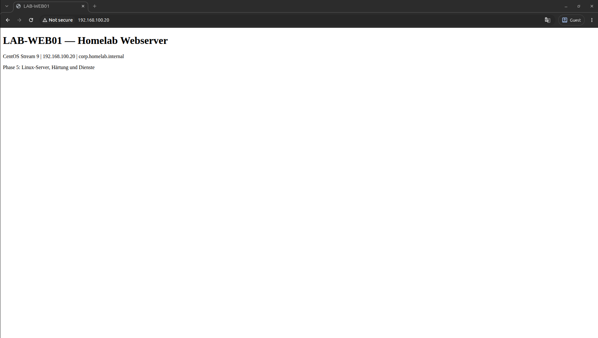
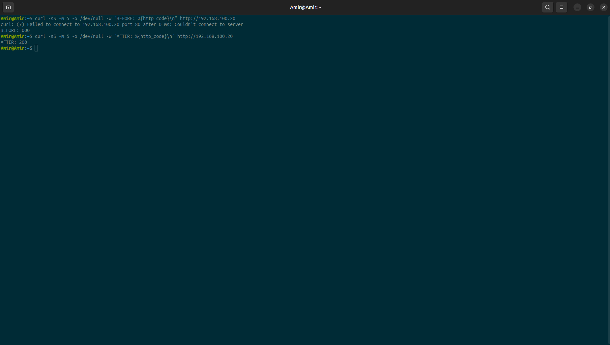
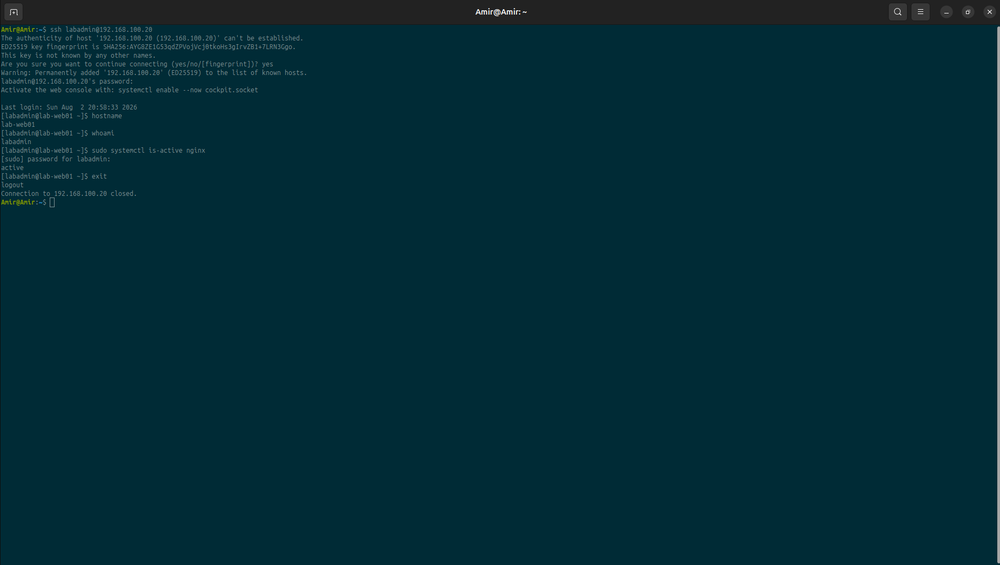
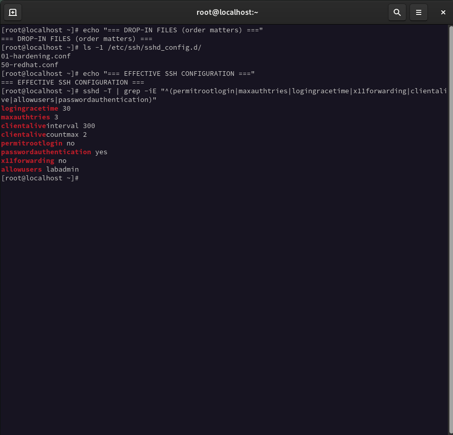
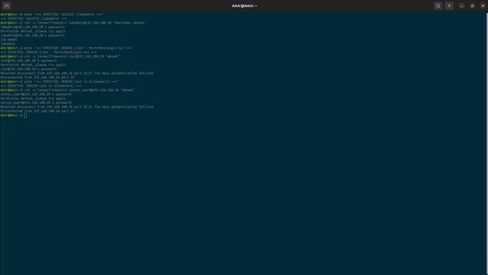
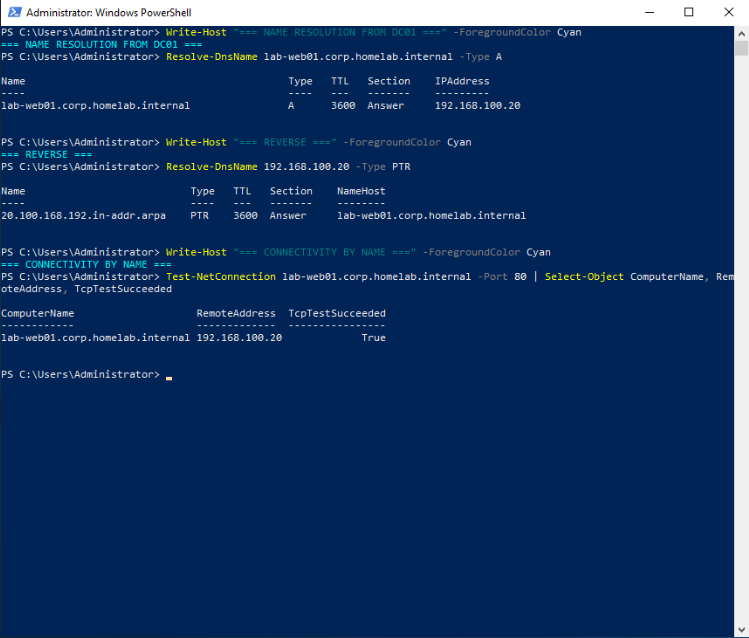
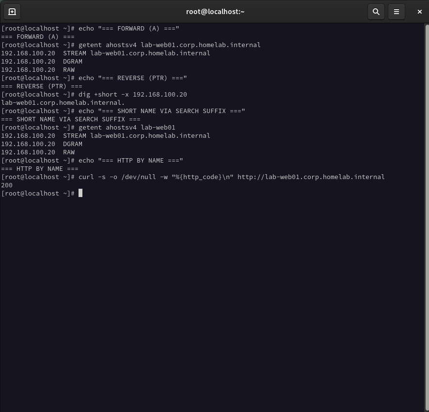

# Phase 5 — Linux Server: Services and Hardening

> Part of the [Homelab project](../../README.md) · German version: [README.de.md](README.de.md)

## 1. Purpose

This phase turns the CentOS Stream 9 virtual machine into a productive member of the domain network: a web server with a static address, correct name resolution, a hardened SSH access path and a minimal firewall surface.

The goal is not "a running web server". A web server is installed in one command. The goal is the surrounding discipline: a documented address plan, a verified name resolution chain, an access concept with a single administrative account, and evidence for every claim.

## 2. Starting Point

| Item | Value |
|---|---|
| VM name | `LAB-WEB01` |
| Operating system | CentOS Stream 9 (kernel `5.14.0-677.el9.x86_64`) |
| Installed packages | 1180 |
| Hostname | not set (`localhost.localdomain`) |
| Network | `enp1s0`, disconnected, no address |
| Users | `centos_user0` (no sudo rights), `root` |
| Default target | `graphical.target` |
| Web server | not installed |

The machine had been created in Phase 2 and was booted for the first time in this phase. It was not part of the domain and had no working network connection.

## 3. Snapshot Strategy

A snapshot was created before the first change:

```bash
virsh snapshot-create-as LAB-WEB01 phase05-pre-hardening \
  "Clean CentOS Stream 9 before network, service and hardening changes"
```

Hardening is the one category of change that can lock the administrator out of the system. A snapshot taken beforehand converts an irreversible mistake into a five minute rollback.

## 4. Hostname and Static Address

The hostname was set in lower case, following the Linux convention, while the libvirt domain name remains upper case:

```bash
hostnamectl set-hostname lab-web01
```

An existing NetworkManager profile for `enp1s0` was already present. It was **modified**, not replaced — creating a second profile for the same interface is a common source of non-deterministic behaviour after a reboot.

```bash
nmcli connection modify enp1s0 \
  ipv4.method manual \
  ipv4.addresses 192.168.100.20/24 \
  ipv4.gateway 192.168.100.1 \
  ipv4.dns 192.168.100.10 \
  ipv4.dns-search corp.homelab.internal \
  ipv6.method disabled \
  connection.autoconnect yes
nmcli connection up enp1s0
```

IPv6 was disabled deliberately: the lab is an IPv4-only environment, and a half-configured second protocol stack produces failures that are hard to diagnose.

Connectivity was then verified from the bottom of the stack upwards — link, address, gateway, neighbour, route, name — instead of testing the final application first.

| Layer | Test | Result |
|---|---|---|
| Address | `ip -4 addr show enp1s0` | `192.168.100.20/24` |
| Gateway | `ping 192.168.100.1` | 0 % loss, `ttl=64` |
| Neighbour | `ping 192.168.100.10` | 0 % loss, `ttl=128` |
| Internet | `ping 8.8.8.8` | 0 % loss, `ttl=111` |
| Internal name | `getent hosts dc01.corp.homelab.internal` | resolved |

The TTL values are informative in themselves: 64 identifies a Linux host, 128 a Windows host. The same fingerprint is used by `nmap -O` in Phase 6.

## 5. Troubleshooting: External Name Resolution

Package installation failed immediately:

```
Errors during downloading metadata for repository 'baseos':
- Curl error (6): Couldn't resolve host name for https://mirrors.centos.org/...
```

Internal names resolved, internet connectivity by IP address worked, and only external names failed. The fault was therefore isolated to name resolution for external zones.

```bash
dig A mirrors.centos.org @192.168.100.10 | grep -E "status:|ANSWER:"
;; ->>HEADER<<- opcode: QUERY, status: NOERROR, id: 51839
;; flags: qr rd ra; QUERY: 1, ANSWER: 2, AUTHORITY: 0, ADDITIONAL: 1
```

`NOERROR` with two answers looks like success. Inspecting the record types showed that both answers were `CNAME` records and that **no A record was present**. The same query against public resolvers returned the full CNAME chain **plus nine IPv4 addresses**.

The domain controller had been configured in Phase 3 to forward to the libvirt gateway `192.168.100.1`, which in turn uses the upstream provider resolver. That upstream resolver strips A records for some destinations. The fault was therefore neither in CentOS nor in the domain controller, but in the forwarding target.

The fix belongs to the layer that owns the problem — external name resolution is the responsibility of the domain controller, not of the client:

```powershell
Set-DnsServerForwarder -IPAddress 8.8.8.8,1.1.1.1 -PassThru
Clear-DnsServerCache -Force
```

After the change the same query returned all nine IPv4 addresses and package installation succeeded. See [ADR-011](../../docs/architecture/decisions.md).

## 6. Web Server

```bash
dnf -y install nginx
systemctl enable --now nginx
```

The repository GPG key `0x8483C65D` was imported during installation and its fingerprint confirmed. Package signatures are the supply chain control of the package manager and are not a formality.

`enable --now` starts the service immediately and registers it for every subsequent boot. A service that only runs until the next reboot is not a service.

A German language start page was written to `/usr/share/nginx/html/index.html`, created directly inside the web root so that it inherits the correct SELinux label. SELinux remained in enforcing mode throughout the phase.

The service was verified through three independent views, because "installed", "running" and "reachable" are three different claims:

```bash
systemctl status nginx      # active (running), enabled
ss -tlnp | grep nginx       # 0.0.0.0:80 and [::]:80
curl -s -o /dev/null -w "%{http_code}\n" http://localhost   # 200
```


*Figure 5.1 — The web server delivering its start page to a browser on the host system.*

## 7. Firewall

A request from the host system was refused while the local request succeeded — the expected behaviour of a correctly working packet filter.

```bash
firewall-cmd --permanent --add-service=http
firewall-cmd --reload
```

firewalld keeps a runtime configuration and a permanent configuration. `--permanent` alone changes only the stored configuration; `--reload` activates it. The same duality exists in libvirt with `--live` and `--config`.

The effect was documented as a before and after pair. The "before" state was reproduced authentically by removing the rule from the runtime configuration only, so that `--reload` restored it from the permanent configuration afterwards:

```
BEFORE: 000    curl: (7) Failed to connect ... after 0 ms
AFTER:  200
```

The immediate failure after 0 ms identifies a `REJECT` policy rather than a silent `DROP`. In Phase 6 the same distinction appears in `nmap` output as `closed` versus `filtered`.


*Figure 5.2 — External access before and after opening the HTTP service in firewalld.*

Two services that were open by default were removed:

| Service | Reason for removal |
|---|---|
| `cockpit` | Web management console, never activated in this lab |
| `dhcpv6-client` | IPv6 is disabled on this host |

The resulting zone contains exactly two services, and both can be justified in one sentence: `http` is the purpose of the machine, `ssh` is its only remote administration path.

## 8. Administrative User

The account created during installation had no administrative rights:

```
centos_user0 is not in the sudoers file. This incident will be reported.
```

A dedicated administrative account was created instead of granting rights to the existing one:

```bash
useradd -m -G wheel -c "Lab Administrator" labadmin
passwd labadmin
```

On RHEL derivatives the `wheel` group corresponds to the `sudo` group on Debian systems. Privilege escalation was tested with the cheapest harmless command available:

```bash
sudo whoami   # root
```

Remote access as `labadmin` was verified **before** any hardening was applied. Closing an access path before proving that an alternative path works — through the same channel that will later be used — is how administrators lock themselves out.


*Figure 5.3 — SSH session from the Ubuntu host to the web server as `labadmin`.*

## 9. SSH Hardening

The hardening was applied as a drop-in file rather than by editing the vendor configuration. A drop-in file can be removed in one command, survives package updates and is a clean artefact for the repository.

| Setting | Before | After | Reason |
|---|---|---|---|
| `PermitRootLogin` | `without-password` | `no` | No direct root login; actions are attributable |
| `MaxAuthTries` | `6` | `3` | Fewer attempts per connection |
| `LoginGraceTime` | `120` | `30` | Shorter window for half-open connections |
| `X11Forwarding` | `yes` | `no` | Not required on a server |
| `ClientAliveInterval` | `0` | `300` | Detects dead sessions |
| `ClientAliveCountMax` | `3` | `2` | Faster cleanup |
| `AllowUsers` | — | `labadmin` | Allow list instead of block list |

The configuration was validated before activation. `sshd_config` is the one file whose syntax error can make a remote system permanently unreachable:

```bash
sshd -t && systemctl reload sshd
```

`reload` was used instead of `restart`, so that existing sessions survive the change and only new connections are evaluated against the new rules.


*Figure 5.4 — Drop-in file order and the effective SSH configuration after hardening.*

## 10. Troubleshooting: Drop-in Order and Connection Penalties

Two instructive problems occurred during the hardening.

**One setting was silently ignored.** After the first reload, six of seven settings were active, but `X11Forwarding` was still `yes`. The syntax test had passed, the reload had succeeded, and no error was produced anywhere.

```
/etc/ssh/sshd_config.d/50-redhat.conf:17   X11Forwarding yes
/etc/ssh/sshd_config.d/99-hardening.conf:5 X11Forwarding no
```

OpenSSH applies the **first** value it finds for a keyword, not the last. Drop-in files are read in alphabetical order, so the distribution file won. The content of the file was correct; its name was wrong. Renaming it to `01-hardening.conf` resolved the problem.

**The server locked out the administrator's own address.** After several failed authentication attempts and expired login grace periods, all further connections from that source address were closed immediately without a password prompt:

```
drop connection #0 from [192.168.100.20]:60380 ... penalty: exceeded LoginGraceTime
```

OpenSSH 9.9 applies per source penalties (`crash:90 authfail:5 grace-exceeded:10 max:600`). The shortened `LoginGraceTime` of 30 seconds made this threshold considerably easier to reach. This is not a defect in either setting, but an interaction between two of them — and the reason why every hardening step must be tested from outside, over a second and independent access path. In this lab that second path was the virtual machine console.

## 11. Access Control Test

A security rule is only proven when it refuses something. Three cases were tested from the host system:

| Account | Expectation | Result | Mechanism |
|---|---|---|---|
| `labadmin` | allowed | `lab-web01` / `labadmin` | listed in `AllowUsers` |
| `root` | denied | `Permission denied` | `PermitRootLogin no` |
| `centos_user0` | denied | `Permission denied` | not in `AllowUsers` |

Both denied attempts were disconnected after exactly three password prompts, which confirms `MaxAuthTries 3` in behaviour rather than in configuration output. The two rejections are enforced by two independent mechanisms — defence in depth.


*Figure 5.5 — One permitted and two denied SSH logins, each with the expected outcome stated before the attempt.*

## 12. DNS Records for the Web Server

Windows servers register themselves in DNS when they join the domain. A Linux server that is not a domain member does not, so the records were created manually on the domain controller:

```powershell
Add-DnsServerResourceRecordA -Name "lab-web01" `
  -ZoneName "corp.homelab.internal" `
  -IPv4Address "192.168.100.20" `
  -CreatePtr
```

The records are static (`Timestamp: 0`) and are therefore not removed by DNS scavenging. Dynamic records are appropriate for clients; server records should be static.

The reverse record populates the reverse lookup zone created in Phase 3 and allows logs and scanning tools to display names instead of addresses.

Verification was performed from a neutral witness rather than from the web server itself:


*Figure 5.6 — Forward record, reverse record and TCP connectivity on port 80, tested from the domain controller.*


*Figure 5.7 — Forward, reverse and short name resolution on the web server, and an HTTP request by name.*

## 13. Verification Matrix

| # | Test | Command | Result |
|---|---|---|---|
| 1 | Static address active | `ip -4 addr show enp1s0` | `192.168.100.20/24` |
| 2 | Gateway reachable | `ping 192.168.100.1` | 0 % loss |
| 3 | Domain controller reachable | `ping 192.168.100.10` | 0 % loss, `ttl=128` |
| 4 | External name resolution | `dig +short A mirrors.centos.org` | 9 A records |
| 5 | Web server running | `systemctl status nginx` | active, enabled |
| 6 | Listening socket | `ss -tlnp` | `0.0.0.0:80` |
| 7 | Local HTTP request | `curl http://localhost` | `200` |
| 8 | External HTTP request | `curl http://192.168.100.20` | `200` |
| 9 | Firewall closed before rule | runtime removal + `curl` | `000` |
| 10 | Firewall open after rule | `--reload` + `curl` | `200` |
| 11 | Cockpit port closed | `curl ...:9090` | `000` |
| 12 | Administrative rights | `sudo whoami` | `root` |
| 13 | SSH as `labadmin` | `ssh labadmin@...` | success |
| 14 | SSH as `root` | `ssh root@...` | denied |
| 15 | SSH outside allow list | `ssh centos_user0@...` | denied |
| 16 | Effective SSH configuration | `sshd -T` | 7 of 7 settings active |
| 17 | Forward record | `Resolve-DnsName ... -Type A` | `192.168.100.20` |
| 18 | Reverse record | `Resolve-DnsName ... -Type PTR` | `lab-web01.corp...` |
| 19 | HTTP by name | `curl http://lab-web01.corp...` | `200` |
| 20 | TCP test from DC01 | `Test-NetConnection ... -Port 80` | `True` |

## 14. Configuration Artefacts

All files were copied from the running system, not retyped:

| File | Content |
|---|---|
| [`01-hardening.conf`](../../configs/phase-05/01-hardening.conf) | SSH hardening drop-in |
| [`firewalld-public-zone.xml`](../../configs/phase-05/firewalld-public-zone.xml) | firewalld zone with exactly two services |
| [`network-enp1s0.txt`](../../configs/phase-05/network-enp1s0.txt) | Effective IPv4 configuration |
| [`nginx-index.html`](../../configs/phase-05/nginx-index.html) | Start page of the web server |

## 15. Snapshots

| Name | Created | Purpose |
|---|---|---|
| `phase05-pre-hardening` | 2026-08-02 20:07 | Clean state before all Phase 5 changes |

## 16. Result

`LAB-WEB01` is a static, name resolvable web server in the domain network. It is reachable on exactly two ports, administered through a single named account, and every configuration decision is documented and reproducible from the artefacts in this repository.

## 17. Lessons Learned

- A change that produces no error message has not necessarily taken effect. Effective configuration must be read back, not assumed.
- OpenSSH uses the first value found for a keyword. Patterns from other configuration systems cannot be transferred without checking.
- Hardening measures interact. A tightened timeout combined with an automatic penalty system locked out the administrator's own address.
- Every hardening step requires a second, independent access path. Console access is not optional during this kind of work.
- `NOERROR` in a DNS response does not mean the answer is useful. Record type and count must be inspected.
- A fault should be repaired at the layer that owns it. External name resolution belongs to the domain controller, not to the client.
- Diagnostic tools ask different questions. `getent` shows what an application sees; `dig` shows what a name server answers.

## 18. Known Limitations

- **Password authentication over SSH is still enabled.** Key based authentication with `PasswordAuthentication no` is the stronger configuration and was postponed for time reasons. This is the most significant open item of the phase.
- **The graphical environment is still installed and active.** A server would normally run `multi-user.target`. The graphical session was retained because the machine is operated from a virtual machine console.
- **`centos_user0` still exists** without administrative rights and without SSH access. In a production environment the account would be removed or locked.
- **`getent hosts lab-web01`** returns the loopback address `::1` on the machine itself, because the `myhostname` name service module answers for the local hostname when the address family is unrestricted. Name resolution is correct for IPv4 and for every other host in the network; this affects the machine's view of itself only.
- **No TLS.** The web server delivers plain HTTP. A certificate infrastructure is out of scope for this phase.
- **No log monitoring.** Failed logins are recorded in `/var/log/secure` but are not evaluated automatically.

## 19. Next Phase

[Phase 6 — Security Testing](../06-security-testing/)
