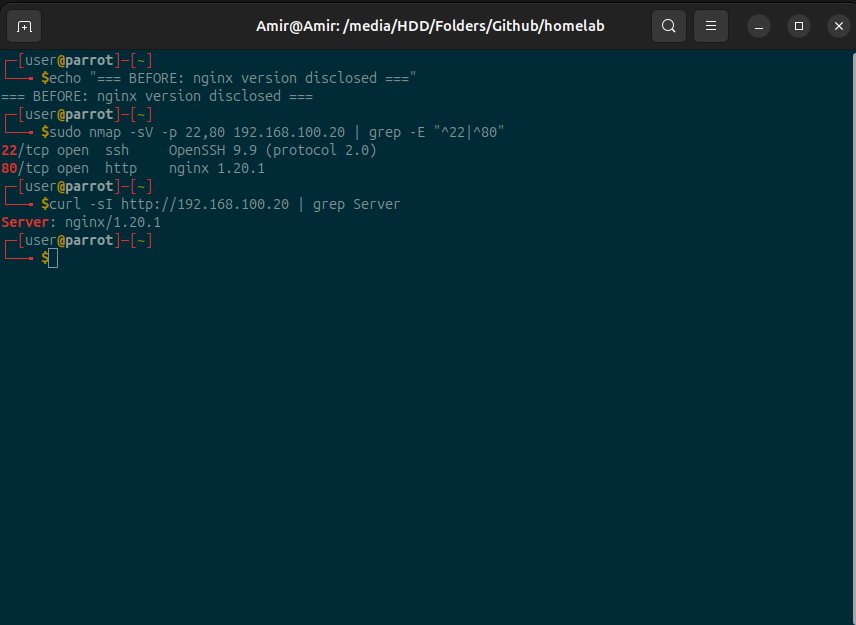
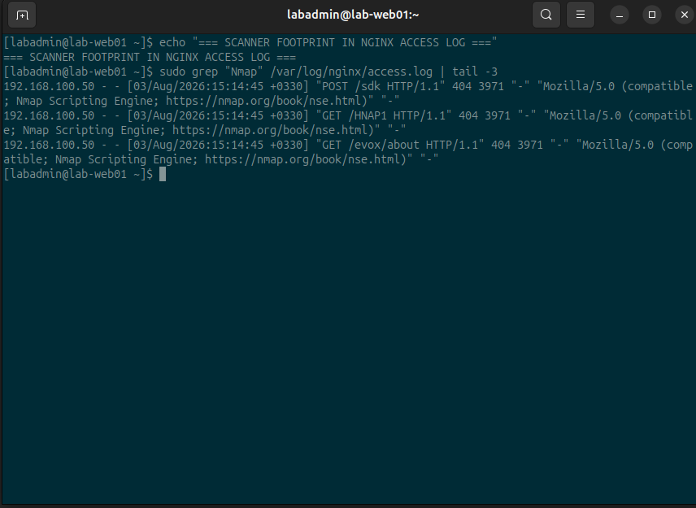
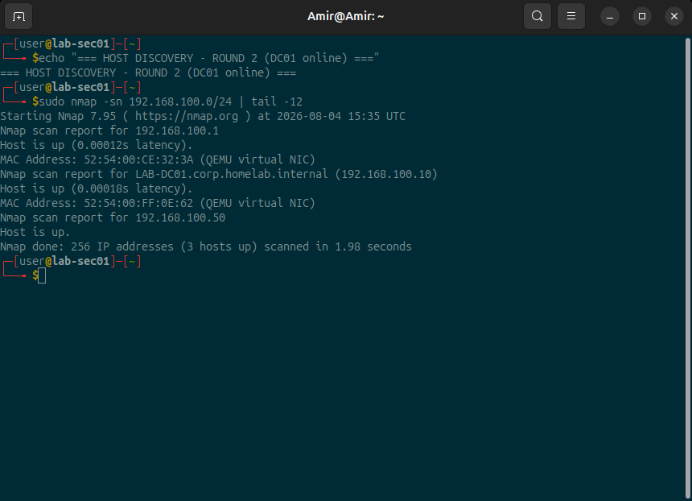
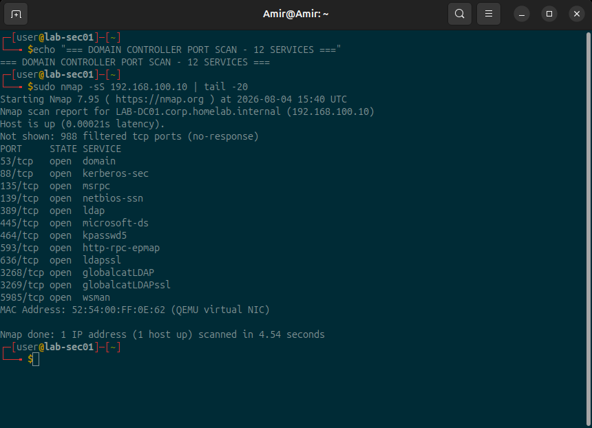
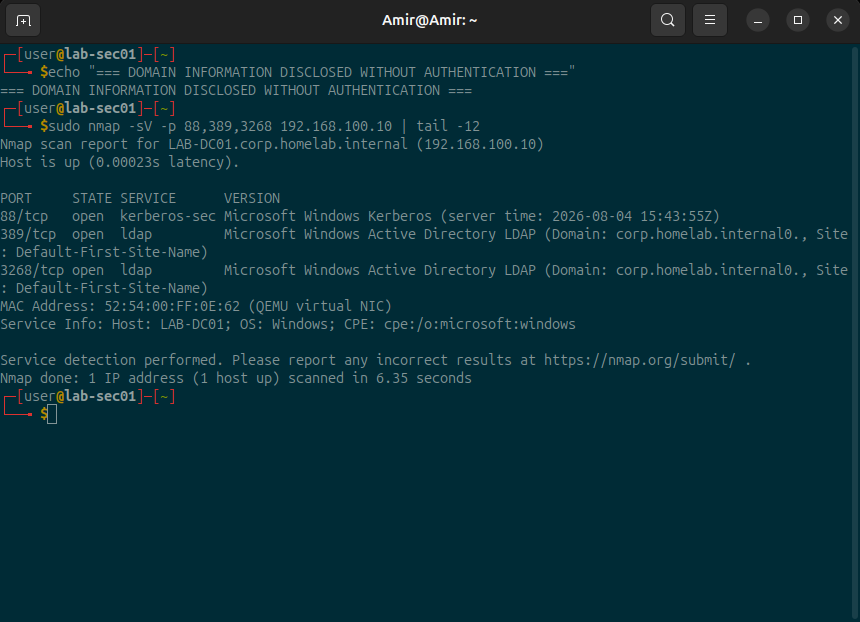
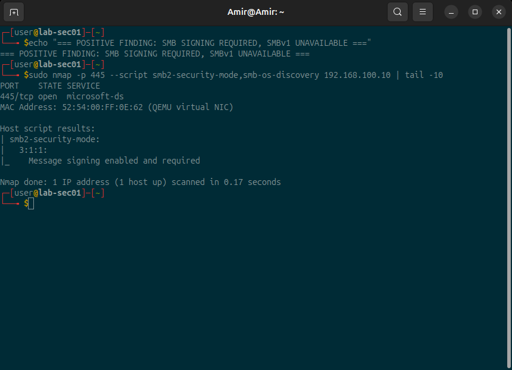
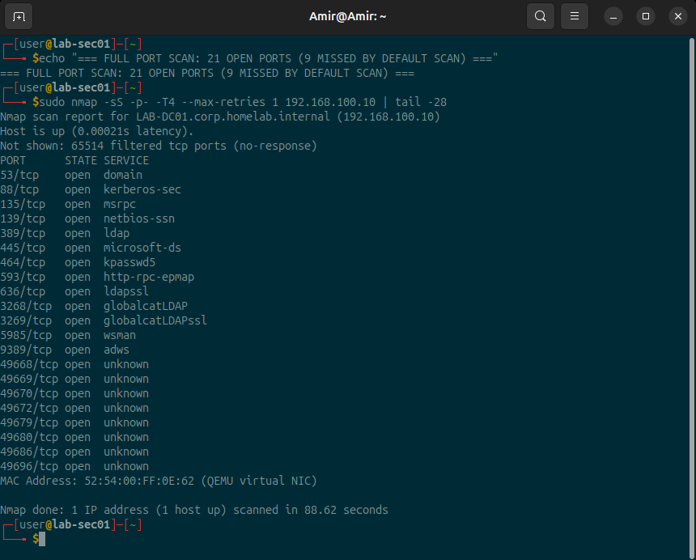
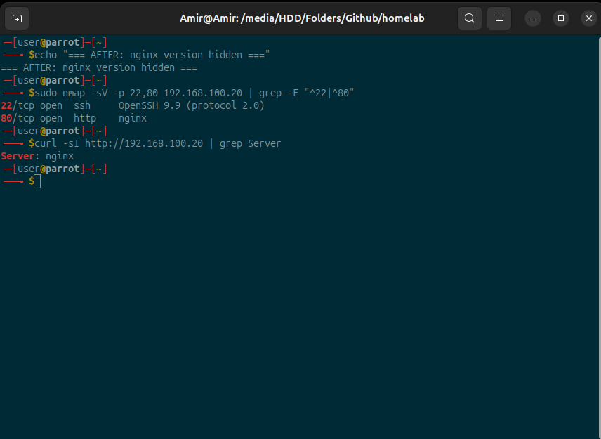

# Phase 6 — Security Testing

## 1. Purpose

The previous phases built and hardened the lab. This phase asks a different
question: **what does the lab actually look like from the outside?**

Hardening produces what was intended. An audit shows what is actually there. The
two are not the same thing, and this phase exists to measure the difference. A
dedicated security machine (`LAB-SEC01`, Parrot Security 7.2) scans the two
servers of the lab, and every claim made in phases 3 to 5 is checked against
measured evidence rather than against memory.

The phase was carried out in two rounds because the host has 16 GB of RAM and
never runs more than two virtual machines at a time:

| Round | Target | Role |
|---|---|---|
| 1 | `LAB-WEB01` (192.168.100.20) | CentOS Stream 9, nginx, SSH, firewalld |
| 2 | `LAB-DC01` (192.168.100.10) | Windows Server 2019, AD DS, DNS, DHCP |

## 2. Starting Point

- Phases 0 to 5 completed: network design, virtualisation, Active Directory,
  domain-joined client, hardened Linux server.
- `LAB-SEC01` existed as a virtual machine from phase 2 but had never been
  configured or started.
- No security assessment of any kind had been carried out at this point.

## 3. Scope and Authorisation

A scan is only legitimate when its scope is defined in writing before it starts.

- **Authorised target network:** `192.168.100.0/24`, an isolated NAT network on
  the author's own hardware, with no route into any third-party network.
- **Authorised targets:** `LAB-WEB01` and `LAB-DC01`, both owned by the author.
- **Source address:** `192.168.100.50`, statically assigned so that every entry
  in a target log can be attributed to the audit without ambiguity.
- **Excluded:** everything outside the lab network, including the host system's
  own internet connection.

The scanner was given a fixed address on purpose. An authorised scan has to be
unambiguously identifiable in the logs; otherwise the defender cannot tell an
audit apart from an attack.

## 4. Tools

| Tool | Version | Used for |
|---|---|---|
| `nmap` | 7.95 | host discovery, port scanning, version and script scans |
| `curl` | 8.14.1 | verifying HTTP response headers |
| `dig` | bind 9 | name resolution checks |
| `ss` | iproute2 | listing local listening sockets |
| `sysctl` | procps | reading kernel network parameters |

`LAB-SEC01` itself was deliberately **not** hardened. Its role is that of an
administrative tool inside a closed lab, not that of an exposed server. The level
of hardening follows the role of a system, not habit.

## 5. Round 1 — Linux Web Server (LAB-WEB01)

### 5.1 Host discovery

```bash
sudo nmap -sn 192.168.100.0/24
```

Three hosts answered: the gateway `.1`, the web server `.20` and the scanner
itself `.50`. No name was resolved for any of them, and the scan took 27.92
seconds — a striking figure for a network with three live hosts. The cause was
not the network: the domain controller, which is the DNS server of this network,
was switched off, so all 253 reverse lookups had to time out. **The execution
time of a tool can itself report a broken service.**

A scan always begins with the question of what exists at all, before asking what
any individual host offers.

### 5.2 Port scan

```bash
sudo nmap -sS 192.168.100.20
```

```
Not shown: 988 filtered tcp ports (no-response), 10 filtered tcp ports (admin-prohibited)
22/tcp open  ssh
80/tcp open  http
```

Exactly two open ports, matching the firewalld service list (`http ssh`)
configured in phase 5. The claim from phase 5 therefore held up under external
measurement.

Every open port needs a one-sentence justification: `22` is the only
administrative access path to the machine, `80` is the reason the machine exists.

### 5.3 Firewall behaviour and ICMP rate limiting

The expectation before the scan was that blocked ports would appear as `closed`.
They appeared as `filtered`, and ten of them carried the reason
`admin-prohibited`. firewalld's default policy is `REJECT` with an ICMP error
message, not a silent drop, so the host actively announces that a firewall is
present.

The ten-versus-988 split was explained by a deliberate experiment rather than by
assumption:

```bash
sudo nmap -sS -p 8000-8004 --scan-delay 1s --reason 192.168.100.20
```

With one second between packets, **all five** ports returned
`admin-prohibited`. The Linux kernel limits ICMP error messages
(`net.ipv4.icmp_ratelimit = 1000`, i.e. one message per second per type), so a
fast scan simply outruns the replies. This is not a firewall weakness; it is
protection against the host being used as an amplifier against a third party.
**The kernel is a security layer too.**

An observed result is not explained until it can be reproduced on purpose.

### 5.4 Service version detection

```bash
sudo nmap -sV -p 22,80 192.168.100.20
```

```
22/tcp open  ssh     OpenSSH 9.9 (protocol 2.0)
80/tcp open  http    nginx 1.20.1
```


*Figure 6.1 — Before remediation: the web server discloses its exact version
number to an unauthenticated client.*

The exact version number is a finding. An attacker does not need to test
vulnerabilities blindly; the number can be looked up in a CVE database, and the
list of applicable attacks is available before the first attempt.

### 5.5 Full port scan

```bash
sudo nmap -sS -p- -T4 --max-retries 1 192.168.100.20
```

All 65535 ports: only `22` and `80` open, 65405 without a response and 128
`admin-prohibited`, in 135.50 seconds. The number of ICMP replies matches the
rate limit measured in section 5.3, which confirms the explanation from a second
direction.

This scan was run because the default scan only examines the 1000 most common
ports — about 1.5 percent of the port space. The statement "there is nothing
else" is only permissible after a complete scan.

### 5.6 Scanner footprint in the web server log

Every audit has to be examined from both sides. On the target:

```bash
sudo grep "Nmap" /var/log/nginx/access.log | tail -3
```

```
"POST /sdk HTTP/1.1" 404 3971 "-" "Nmap Scripting Engine"
"GET /HNAP1 HTTP/1.1" 404 3971 "-" "Nmap Scripting Engine"
"GET /evox/about HTTP/1.1" 404 3971 "-" "Nmap Scripting Engine"
```


*Figure 6.3 — Scanner footprint in the nginx access log. The `+0330` timestamps
predate the timezone correction documented in section 7.2.*

The scan was fully visible to the defender. The `User-Agent` field named the tool
honestly, but that field is a self-declaration and not an identity: an attacker
sets it to whatever they like. Reliable detection therefore relies on behaviour —
many 404 responses to non-existent paths within seconds — not on what the client
claims to be.

Prevention stops some attacks; logging is what makes the rest noticeable.

## 6. Round 2 — Domain Controller (LAB-DC01)

### 6.1 Operating system disclosure before the first scan

Before the scanner was even started, a plain `ping` from the host was used as the
cheapest possible reachability check:

```
64 bytes from 192.168.100.10: icmp_seq=1 ttl=128 time=0.205 ms
```

`ttl=128` identifies a Windows system; Linux answers with 64, as `LAB-WEB01` did.
The operating system family is therefore disclosed before a single port is
scanned. Reconnaissance begins before the first scan.

Unlike `LAB-WEB01`, the domain controller answers ICMP echo requests. In a domain
this is an intentional operational decision: monitoring and diagnostics depend on
it.

### 6.2 Host discovery and reverse DNS

```
LAB-DC01.corp.homelab.internal (192.168.100.10)
3 hosts up, scanned in 1.98 seconds
```


*Figure 6.4 — With the DNS server running, reverse lookup resolves the full name
of the domain controller.*

Two observations:

1. The same command that took 27.92 seconds in round 1 now took 1.98 seconds.
   The difference was 253 DNS timeouts, not the network.
2. Reverse resolution hands an unauthenticated client the host name, the internal
   naming scheme `LAB-XX`, the machine's role and the domain name — all for free.
   The PTR records created in phase 5 are operationally necessary for diagnostics
   and log analysis, and informationally costly at the same time. The trade-off is
   accepted deliberately.

`192.168.100.20` is missing from this round because `LAB-WEB01` was powered off
for memory reasons. **A scan is a snapshot, not an inventory.**

### 6.3 Port scan and attack surface

```bash
sudo nmap -sS 192.168.100.10
```


*Figure 6.5 — Twelve open ports on the domain controller, compared with two on
the web server.*

| Port | Service | Justification |
|---|---|---|
| 53 | DNS | name resolution for the entire domain |
| 88 | Kerberos | authentication |
| 135 | RPC endpoint mapper | basis of Windows RPC communication |
| 139 | NetBIOS session | legacy name service, installed with the role |
| 389 | LDAP | directory queries |
| 445 | SMB | SYSVOL and NETLOGON shares, group policy delivery |
| 464 | kpasswd | password changes |
| 593 | RPC over HTTP | installed together with the domain role |
| 636 | LDAPS | LDAP over TLS |
| 3268 | Global Catalog | forest-wide search |
| 3269 | Global Catalog SSL | the same over TLS |
| 5985 | WinRM | remote management and remote command execution |

**Two open ports versus twelve.** The difference is not a difference in effort;
it is a difference in role. A domain controller cannot reduce its port list at
will, because each of these ports is a service the domain depends on. It is
therefore not protected by closing ports but by controlling who can reach
them — that is, by network segmentation (see ADR-006).

Positive finding: **port 3389 (RDP) is not open.** Remote Desktop was never
enabled, even though the machine was administered through the graphical console.

Firewall behaviour differed again. All 988 filtered ports returned
`no-response` and **not a single ICMP error**. Windows Firewall drops silently
while firewalld rejects with a message. Three distinct behaviours have now been
observed in one network:

| Policy | nmap result | Speed | Information given away |
|---|---|---|---|
| `REJECT` with ICMP error | `filtered` | slow | a firewall exists |
| `REJECT` with TCP reset | `closed` | fast | a firewall exists |
| `DROP` without any answer | `filtered` | fast | nothing |

The behaviour of a firewall cannot be derived from the operating system. It has
to be measured.

### 6.4 Service version detection and protocol-inherent disclosure

```bash
sudo nmap -sV -p 53,88,135,389,445,3268,5985 192.168.100.10
```


*Figure 6.6 — Without any authentication the scanner learns the domain name, the
AD site name and the server clock.*

```
88/tcp   Microsoft Windows Kerberos (server time: 2026-08-04 15:42:05Z)
389/tcp  Microsoft Windows Active Directory LDAP (Domain: corp.homelab.internal, Site: Default-First-Site-Name)
445/tcp  microsoft-ds?
Service Info: Host: LAB-DC01; OS: Windows; CPE: cpe:/o:microsoft:windows
```

On `LAB-WEB01` the equivalent disclosure was closed with a single directive. Here
it cannot be:

- **LDAP has to name the domain it serves,** otherwise no client could bind to it.
- **Kerberos has to publish its clock,** because the protocol is built on time:
  tickets expire, and a clock skew above five minutes breaks authentication
  outright. The trailing `Z` also confirms the machine runs in UTC.

What a protocol requires cannot be switched off — only limited, again through
segmentation. This is the second independent argument for ADR-006, and this one
is backed by measurement rather than by theory.

Two qualifications belong in the report:

- Port 53 was reported as `Simple DNS Plus`. **That is wrong.** The service is the
  Windows DNS Server role installed in phase 3. Version detection compares
  responses against a signature database and returns the closest match, which can
  be the wrong product. The error was caught by cross-checking against this
  project's own documentation. A tool delivers a presumption; the confirmation is
  the auditor's job.
- Port 445 returned `microsoft-ds?`. The question mark means the service was not
  confirmed. Modern SMB does not volunteer the operating system build — a positive
  finding, not a gap in the scan.

### 6.5 SMB security test

```bash
sudo nmap -p 445 --script smb2-security-mode,smb-os-discovery 192.168.100.10
```


*Figure 6.7 — SMB message signing is required, and the SMBv1-based script
returns nothing.*

```
| smb2-security-mode:
|   3:1:1:
|_    Message signing enabled and required
```

- **Signing is enabled and required.** SMB relay attacks, one of the most common
  privilege-escalation paths in real networks, do not work against this host.
- **Dialect 3.1.1** is the current SMB version, with pre-authentication integrity
  checking and encryption support.
- **`smb-os-discovery` returned nothing.** That script depends on SMBv1, so the
  absence of output is the actual result: SMBv1 — the protocol WannaCry spread
  through — is not available. When the evidence is an absence, the header of the
  screenshot becomes part of the evidence.

An honest note: these three properties are **secure defaults of Windows Server
2019** and not an achievement of this project. The contribution of the audit is
the proof that they are actually active. A report that lists only weaknesses is
half a report.

### 6.6 Full port scan and dynamic RPC ports

```bash
sudo nmap -sS -p- -T4 --max-retries 1 192.168.100.10
```


*Figure 6.8 — The full scan finds 21 open ports: nine more than the default
scan.*

**21 open ports in total.** The default scan of the 1000 most common ports found
12, so it would have missed 43 percent of this server's attack surface. On
`LAB-WEB01` the full scan found nothing new; here it found nine additional ports.
The value of a complete scan cannot be judged from a single host.

The nine ports are `9389` (Active Directory Web Services) and eight dynamic RPC
endpoints between `49668` and `49696`.

**Those eight numbers are not stable.** Windows assigns dynamic RPC endpoints at
boot time from the range `49152-65535`, so they change after every restart. The
correct finding is therefore "eight dynamic RPC ports in the range 49152-65535",
not a fixed list. Part of the attack surface has no fixed number.

This has a practical consequence: a strict per-port firewall rule set for a domain
controller is not possible unless the RPC range is deliberately restricted in
Windows. Segmentation is the realistic control, not a port list.

Duration: 88.62 seconds against 135.50 seconds for the Linux host. The scan
method was identical in both rounds, which is what makes the two results
comparable at all. The Linux host was slower to scan because its ICMP rate
limiting delayed every rejection. `DROP` makes a host quieter but speeds the
attacker up; `REJECT` gives information away but costs the attacker time.

## 7. Findings and Remediation

### 7.1 Finding 1 — nginx version disclosure (fixed)

**Finding:** the web server disclosed `nginx 1.20.1` in its `Server` header.

**Remediation** — a drop-in file rather than an edit of the vendor configuration:

```bash
printf 'server_tokens off;\n' | sudo tee /etc/nginx/conf.d/security.conf
sudo nginx -t
sudo systemctl reload nginx
```

**Verification:**

```
80/tcp open  http    nginx
Server: nginx
```


*Figure 6.2 — After remediation: the service is still identified, but the version
number is gone.*

Two details of method matter here:

- The "before" evidence was captured **before** the change. The evidence window
  closes the moment the change is applied.
- `22/tcp OpenSSH 9.9` was measured before and after and did **not** change. That
  is the control group: a change is only understood when it is also known what it
  did not change.

This is cosmetic hardening, not a fix for a vulnerability. It raises the effort
required for automated mass scanning; it does not make the server invulnerable.

### 7.2 Finding 2 — deviating timezone (fixed)

**Finding:** the log entries of the scan carried `+0330` (`Asia/Tehran`) while the
domain controller and the whole Active Directory run in UTC. Correlating events
across machines would require mental arithmetic on every single line, and a chain
of evidence that needs arithmetic is a weak chain of evidence.

**Remediation:**

```bash
sudo timedatectl set-timezone UTC
```

**Verification** — and this is the part that mattered: after the change,
`timedatectl` reported UTC, but the nginx log kept writing `+0330`. Running
processes had inherited the old timezone. Only after `systemctl reload nginx`,
which spawns new worker processes, did the log show `+0000`.

A system-level change leaves running processes behind. Verification has to happen
at the place the claim is about — here the log file, not the command output.

Clock skew and timezone mismatch are two different problems: skew destroys
services, differing timezones destroy the chain of evidence. This decision is
recorded as ADR-012.

### 7.3 Comparison of attack surfaces

| | `LAB-WEB01` | `LAB-DC01` |
|---|---|---|
| Role | web and SSH server | domain controller, DNS, DHCP |
| Open ports (top 1000) | 2 | 12 |
| Open ports (all 65535) | 2 | 21 |
| Firewall policy | `REJECT` with ICMP | silent `DROP` |
| ICMP echo | blocked | permitted, intentionally |
| Version disclosure | fixed | not fixable, protocol-inherent |
| TTL | 64 (Linux) | 128 (Windows) |
| Duration of full scan | 135.50 s | 88.62 s |

The central insight of this phase is in the first two rows: **the attack surface
follows the role of a system.** The web server could be reduced to two ports
because it does two things. The domain controller cannot be reduced, because
every one of its 21 ports is a service the domain depends on.

## 8. Verification Matrix

| # | Claim | Method | Result |
|---|---|---|---|
| 1 | Only `http` and `ssh` reachable on WEB01 | `nmap -sS` | ✅ 2 open ports |
| 2 | No further ports outside the top 1000 on WEB01 | `nmap -sS -p-` | ✅ 2 of 65535 |
| 3 | firewalld rejects with an ICMP error | `nmap --reason` | ✅ `admin-prohibited` |
| 4 | The 988/10 split is caused by rate limiting | `--scan-delay 1s` | ✅ 5 of 5 |
| 5 | nginx no longer discloses its version | `nmap -sV`, `curl -sI` | ✅ `Server: nginx` |
| 6 | The SSH banner was unchanged (control group) | `nmap -sV -p 22` | ✅ identical |
| 7 | The scan is visible in the web server log | `grep` in `access.log` | ✅ 404 pattern |
| 8 | WEB01 logs in UTC | `access.log` after reload | ✅ `+0000` |
| 9 | DC01 is a Windows system | `ping`, TTL | ✅ `ttl=128` |
| 10 | Reverse DNS resolves the DC name | `nmap -sn` | ✅ FQDN resolved |
| 11 | All AD services are reachable | `nmap -sS` | ✅ 12 expected ports |
| 12 | RDP is not exposed | `nmap -sS -p-` | ✅ 3389 not open |
| 13 | Windows Firewall drops silently | `nmap -sS` | ✅ 0 ICMP errors |
| 14 | SMB signing is required | `smb2-security-mode` | ✅ required |
| 15 | SMBv1 is unavailable | `smb-os-discovery` | ✅ no output |
| 16 | No further ports outside the top 1000 on DC01 | `nmap -sS -p-` | ❌ 9 more found |
| 17 | The DNS product was identified correctly | comparison with phase 3 | ❌ misidentified |

Rows 16 and 17 are deliberately left in the matrix. A verification matrix that
contains only ticks was not used as a test but as a decoration.

## 9. Configuration Artefacts

| File | Content |
|---|---|
| [`nmap-scan-results.txt`](../../configs/phase-06/nmap-scan-results.txt) | raw scan output round 1 (`LAB-WEB01`), with analysis |
| [`nmap-scan-results-dc01.txt`](../../configs/phase-06/nmap-scan-results-dc01.txt) | raw scan output round 2 (`LAB-DC01`), with analysis |

Both files were copied from the terminal, never retyped. A configuration artefact
that has been retyped is no longer evidence.

## 10. Evidence

All eight screenshots are in [`screenshots/phase-06/`](../../screenshots/phase-06/).
The number prefix carries the reading order, and each file name states the claim
the image proves.

## 11. Result

The lab was audited from an independent vantage point for the first time. The
firewall rules, service lists and DNS records of phases 3 to 5 were confirmed by
external measurement rather than assumed. Two weaknesses were found and fixed
with before-and-after evidence, four positive findings were documented and
credited to the vendor where they were vendor defaults, and two predictions of
the author were disproved and left in the report.

The most important result is not a fixed weakness. It is the discovery that the
two servers cannot be measured against the same standard: what was a fixable
finding on the web server is an unavoidable property of the protocol on the
domain controller.

## 12. Lessons Learned

1. **Hardening produces what was intended; an audit shows what is actually
   there.** Both findings of this phase were made visible by the independent
   check, not by the hardening itself.
2. **The behaviour of a firewall cannot be derived from the operating system.**
   Three different behaviours were observed in one network, each following its
   own default policy.
3. **The default scan covers 1.5 percent of the port space.** On one host that
   was enough; on the other it hid 43 percent of the attack surface.
4. **A scan is a snapshot, not an inventory.** `LAB-WEB01` is absent from round 2
   because it was switched off, not because it does not exist.
5. **The execution time of a tool is evidence too.** 27.92 seconds versus 1.98
   seconds reported a service outage before any port was scanned.
6. **Some disclosure is the protocol itself.** LDAP must name its domain,
   Kerberos its clock. Not switchable off, only limitable.
7. **A tool delivers a presumption, the auditor delivers the confirmation.** The
   misidentified DNS product was caught by a second source: this project's own
   documentation.
8. **Empty output can be the result.** The silent SMBv1 script is the proof that
   SMBv1 is gone.
9. **Test what should not have changed.** The unchanged SSH banner is what makes
   the nginx result attributable to the nginx change.
10. **Verify at the place the claim is about.** The timezone was corrected in the
    system and still wrong in the log file until the service was reloaded.
11. **Secure defaults belong to the vendor.** What belongs to the audit is the
    proof that they are active.
12. **Part of an attack surface has no fixed number.** Dynamic RPC ports change
    at every reboot, which is why a domain controller is protected by
    segmentation and not by a port list.

## 13. Known Limitations

- **The target-side evidence on `LAB-DC01` was not collected.** For
  `LAB-WEB01` the nginx access log proved that the scan was visible to the
  defender; the equivalent proof for the domain controller — Windows security
  event log and firewall logging — was not examined in this round. The claim is
  therefore not made.
- **Both servers were never scanned in the same run.** The 16 GB of host memory
  allow two virtual machines at a time, so the two rounds are separated in time.
  The comparison table in section 7.3 combines two measurements, not one.
- **No authenticated tests, no vulnerability scanner.** The audit examined the
  externally visible attack surface. Neither authenticated configuration reviews
  (for example a CIS benchmark) nor a vulnerability scanner such as OpenVAS or
  Nessus were used. Statements about patch level are therefore not made.
- **UDP was not scanned.** DNS, Kerberos and DHCP also listen on UDP; only TCP
  was measured.
- **`PasswordAuthentication yes` remains active on `LAB-WEB01`.** Key-based
  authentication would be the correct choice; in a lab that has to be
  reproducible for demonstration purposes, password login was kept deliberately.
- **No IDS or IPS is in place.** The scan was reconstructed from the web server's
  own log. Detection of scans as such is not implemented.
- **`LAB-SEC01` is deliberately not hardened.** It is an administrative tool in a
  closed lab, not an exposed server.
- **Guest-to-host clipboard on `LAB-SEC01` is broken** (`spice-vdagent`). Working
  around it via SSH was faster than repairing it; the defect is documented rather
  than fixed.
- **The eight dynamic RPC port numbers in the artefact are only valid for the
  boot session of 2026-08-04.**

## 14. Next Phase

[Phase 7 — Documentation](../07-documentation)
